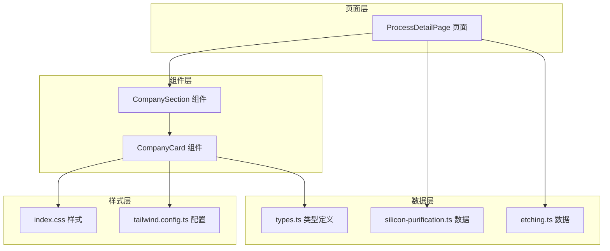
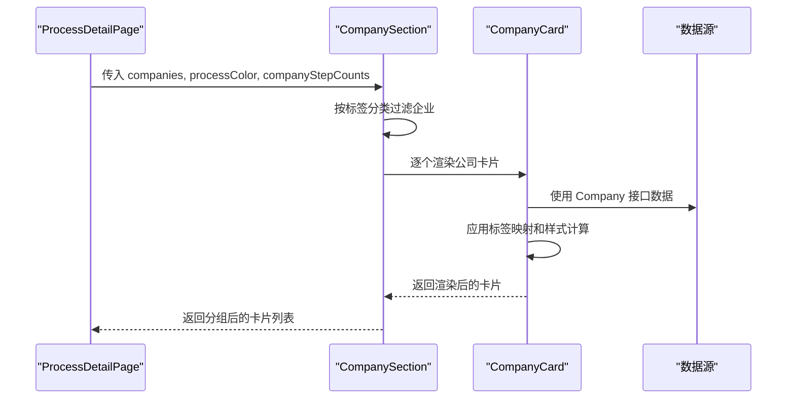
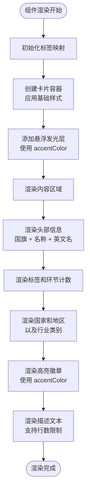
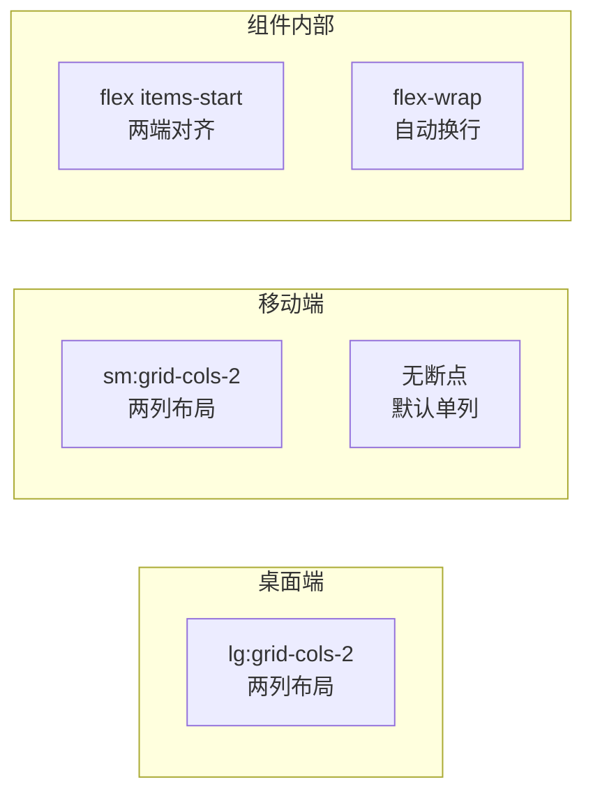
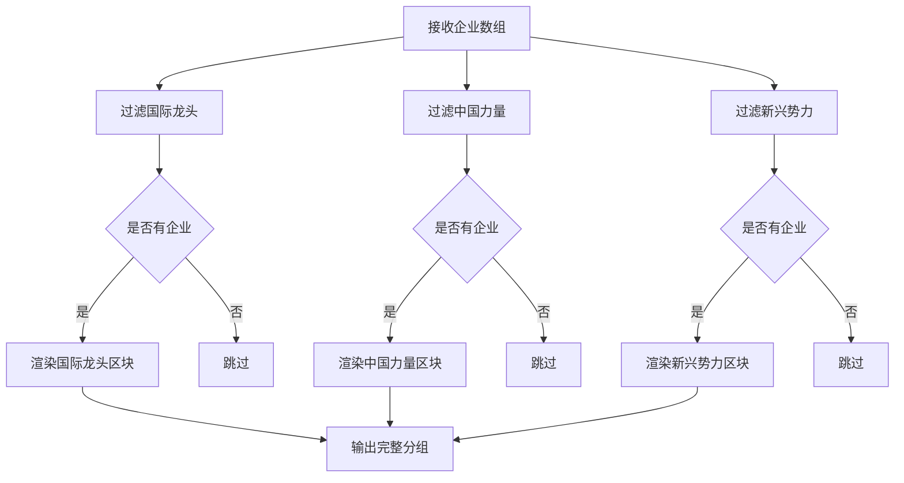
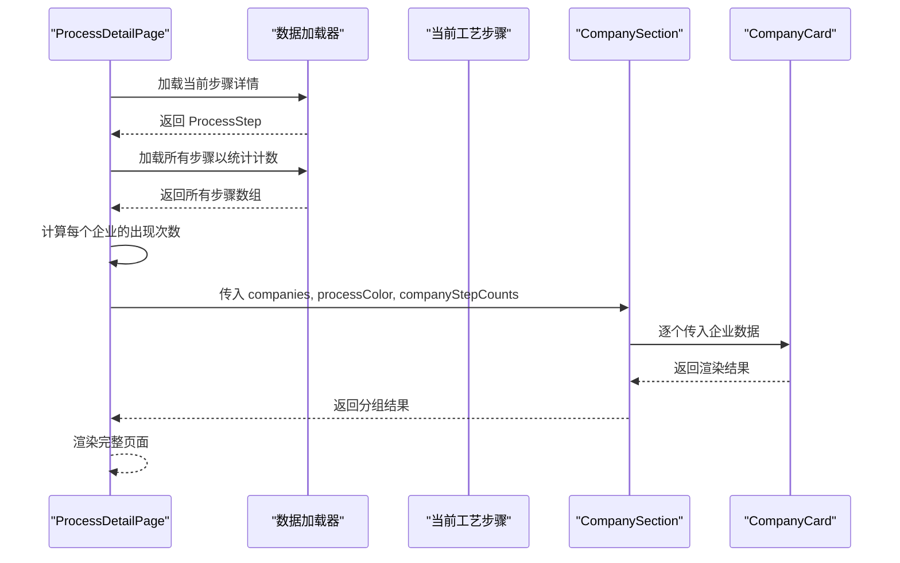
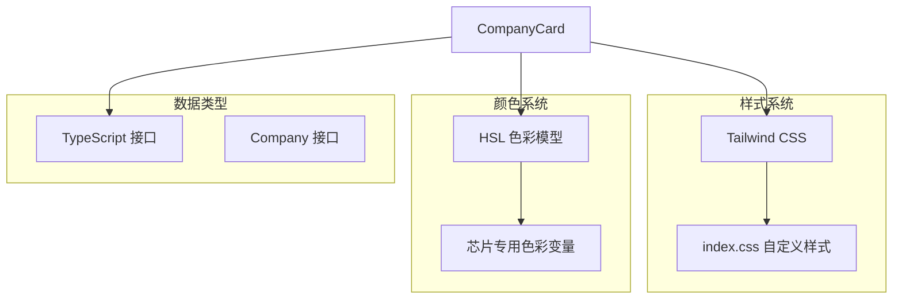
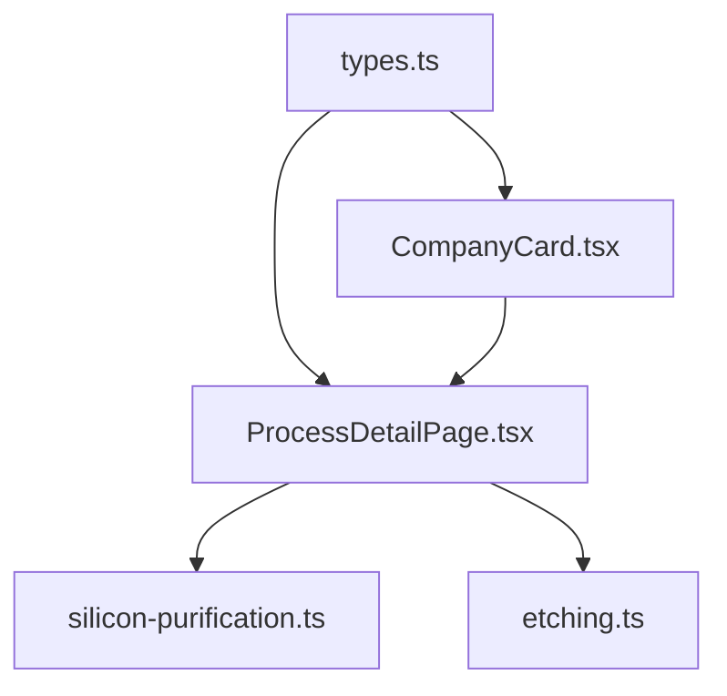

# 公司卡片组件

<cite>
**本文档引用的文件**
- [CompanyCard.tsx](file://src/components/ui/CompanyCard.tsx)
- [types.ts](file://src/data/types.ts)
- [ProcessDetailPage.tsx](file://src/components/layout/ProcessDetailPage.tsx)
- [index.css](file://src/index.css)
- [tailwind.config.ts](file://tailwind.config.ts)
- [silicon-purification.ts](file://src/data/steps/silicon-purification.ts)
- [etching.ts](file://src/data/steps/etching.ts)
</cite>

## 目录
1. [简介](#简介)
2. [项目结构](#项目结构)
3. [核心组件](#核心组件)
4. [架构概览](#架构概览)
5. [详细组件分析](#详细组件分析)
6. [依赖关系分析](#依赖关系分析)
7. [性能考量](#性能考量)
8. [故障排除指南](#故障排除指南)
9. [结论](#结论)
10. [附录](#附录)

## 简介
本文档深入分析了公司卡片组件（CompanyCard）的实现架构，涵盖数据绑定机制、卡片布局设计和信息展示逻辑。组件负责在芯片制造流程页面中展示相关企业的详细信息，包括公司基本信息、标签分类、国家地区、行业类别以及描述内容等。通过清晰的视觉层次和响应式设计，帮助用户快速理解各企业在整个制造流程中的角色定位。

## 项目结构
公司卡片组件位于UI组件目录中，与数据类型定义紧密关联，并在流程详情页面中被调用使用。



**图表来源**
- [CompanyCard.tsx:1-159](file://src/components/ui/CompanyCard.tsx#L1-L159)
- [types.ts:1-33](file://src/data/types.ts#L1-L33)
- [ProcessDetailPage.tsx:1-397](file://src/components/layout/ProcessDetailPage.tsx#L1-L397)

**章节来源**
- [CompanyCard.tsx:1-159](file://src/components/ui/CompanyCard.tsx#L1-L159)
- [types.ts:1-33](file://src/data/types.ts#L1-L33)

## 核心组件
公司卡片组件包含两个主要部分：
- CompanyCard：单个公司的信息展示卡片
- CompanySection：按标签分类的企业分组展示容器

### 数据绑定机制
组件通过props接收Company接口数据，实现类型安全的数据传递：
- company：Company接口实例，包含完整的公司信息
- accentColor：强调色，用于动态样式计算
- stepCount：可选的环节计数，用于显示跨多个工艺步骤的企业

### 属性接口定义
Company接口定义了完整的公司信息结构：

```mermaid
classDiagram
class Company {
+string name
+string nameEn
+string country
+string flag
+string description
+string highlight
+Tag tag
+Category category
}
class Tag {
<<enumeration>>
"国际龙头"
"中国力量"
"新兴势力"
}
class Category {
<<enumeration>>
"设备商"
"材料商"
"代工厂"
"IDM"
"EDA/IP"
"封测"
}
Company --> Tag : "使用"
Company --> Category : "使用"
```

**图表来源**
- [types.ts:1-10](file://src/data/types.ts#L1-L10)

**章节来源**
- [types.ts:1-10](file://src/data/types.ts#L1-L10)

## 架构概览
公司卡片组件采用函数式组件设计，结合Tailwind CSS实现响应式布局和主题化样式。



**图表来源**
- [ProcessDetailPage.tsx:388](file://src/components/layout/ProcessDetailPage.tsx#L388)
- [CompanyCard.tsx:99-158](file://src/components/ui/CompanyCard.tsx#L99-L158)

## 详细组件分析

### CompanyCard 组件分析

#### 视觉设计架构
组件采用渐变背景和悬浮发光效果的设计理念：



**图表来源**
- [CompanyCard.tsx:9-91](file://src/components/ui/CompanyCard.tsx#L9-L91)

#### 标签系统设计
组件实现了三种企业标签，每种标签对应不同的视觉风格：

| 标签类型 | 颜色方案 | 发光效果 | 使用场景 |
|---------|---------|---------|---------|
| 国际龙头 | 金色系 | 金黄色发光 | 全球领先企业 |
| 中国力量 | 蓝绿色系 | 蓝绿色发光 | 中国主导企业 |
| 新兴势力 | 绿色系 | 绿色发光 | 新兴成长企业 |

#### 响应式布局策略
组件采用Tailwind CSS的响应式类名实现自适应布局：



**图表来源**
- [CompanyCard.tsx:115-150](file://src/components/ui/CompanyCard.tsx#L115-L150)

**章节来源**
- [CompanyCard.tsx:9-91](file://src/components/ui/CompanyCard.tsx#L9-L91)
- [CompanyCard.tsx:99-158](file://src/components/ui/CompanyCard.tsx#L99-L158)

### CompanySection 组件分析

#### 分组展示逻辑
CompanySection组件实现了按企业标签的智能分组展示：



**图表来源**
- [CompanyCard.tsx:99-158](file://src/components/ui/CompanyCard.tsx#L99-L158)

**章节来源**
- [CompanyCard.tsx:99-158](file://src/components/ui/CompanyCard.tsx#L99-L158)

### 数据流分析

#### 在流程详情页面中的使用
ProcessDetailPage组件负责组装完整的数据流：



**图表来源**
- [ProcessDetailPage.tsx:36-80](file://src/components/layout/ProcessDetailPage.tsx#L36-L80)
- [ProcessDetailPage.tsx:388](file://src/components/layout/ProcessDetailPage.tsx#L388)

**章节来源**
- [ProcessDetailPage.tsx:36-80](file://src/components/layout/ProcessDetailPage.tsx#L36-L80)
- [ProcessDetailPage.tsx:388](file://src/components/layout/ProcessDetailPage.tsx#L388)

## 依赖关系分析

### 外部依赖
组件依赖于以下外部库和工具：



**图表来源**
- [index.css:28-34](file://src/index.css#L28-L34)
- [tailwind.config.ts:53-60](file://src/tailwind.config.ts#L53-L60)

### 内部依赖关系
组件之间的依赖关系清晰明确：



**图表来源**
- [types.ts:1-33](file://src/data/types.ts#L1-L33)
- [CompanyCard.tsx:1](file://src/components/ui/CompanyCard.tsx#L1)
- [ProcessDetailPage.tsx:18](file://src/components/layout/ProcessDetailPage.tsx#L18)

**章节来源**
- [index.css:28-34](file://src/index.css#L28-L34)
- [tailwind.config.ts:53-60](file://src/tailwind.config.ts#L53-L60)

## 性能考量

### 渲染优化策略
组件采用了多项性能优化措施：

1. **条件渲染**：仅在stepCount大于1时显示环节计数
2. **样式计算缓存**：标签映射对象在组件内部定义，避免重复计算
3. **响应式断点**：使用Tailwind的内置断点系统，减少自定义媒体查询
4. **渐进式样式**：发光效果使用CSS过渡，避免JavaScript动画开销

### 内存使用优化
- Props解构避免不必要的状态提升
- 函数式组件无状态特性减少内存占用
- 条件渲染避免渲染不必要元素

### 可访问性考虑
- 使用role="img"和aria-label提供图像替代文本
- 语义化HTML结构保证屏幕阅读器友好
- 颜色对比度符合WCAG标准

## 故障排除指南

### 常见问题诊断

#### 标签样式异常
**症状**：标签颜色显示不正确
**可能原因**：
- tag值不在预定义集合中
- CSS变量未正确加载
- Tailwind配置缺失

**解决方法**：
1. 检查Company接口的tag字段值
2. 验证tailwind.config.ts中的chip颜色配置
3. 确认index.css中的CSS变量定义

#### 发光效果不显示
**症状**：悬浮发光效果缺失
**可能原因**：
- accentColor参数为空
- 父容器overflow设置影响遮罩层
- 浏览器兼容性问题

**解决方法**：
1. 确保传入有效的颜色值
2. 检查父容器的overflow属性
3. 测试不同浏览器的CSS支持情况

#### 响应式布局失效
**症状**：移动端布局异常
**可能原因**：
- Tailwind断点配置错误
- 容器宽度不足
- flex布局属性冲突

**解决方法**：
1. 验证sm和lg断点配置
2. 检查容器的最小宽度设置
3. 确认flex属性的正确使用

**章节来源**
- [CompanyCard.tsx:10-20](file://src/components/ui/CompanyCard.tsx#L10-L20)
- [tailwind.config.ts:18-61](file://src/tailwind.config.ts#L18-L61)

## 结论
公司卡片组件展现了优秀的组件化设计理念，通过清晰的职责分离、类型安全的数据绑定和灵活的样式系统，实现了高度可复用的企业信息展示功能。组件的设计充分考虑了响应式布局、可访问性和性能优化，为复杂的芯片制造流程页面提供了直观的信息展示方案。

组件的核心优势包括：
- 类型安全的数据接口设计
- 灵活的主题化样式系统
- 智能的标签分类展示
- 优秀的响应式布局支持
- 良好的可维护性和扩展性

## 附录

### 使用示例

#### 基础使用
```typescript
// 在流程详情页面中使用
<CompanySection 
  companies={currentStep.companies}
  processColor={currentStep.color}
  companyStepCounts={companyStepCounts}
/>
```

#### 自定义样式
```typescript
// 传入自定义强调色
<CompanyCard 
  company={selectedCompany}
  accentColor="#ff6b35"
  stepCount={companyStepCounts[selectedCompany.nameEn]}
/>
```

### 最佳实践建议
1. **数据完整性**：确保Company接口的所有必需字段都已正确填充
2. **颜色一致性**：使用流程步骤的颜色作为accentColor，保持视觉统一
3. **性能监控**：关注大数据量时的渲染性能，必要时考虑虚拟化
4. **可访问性**：始终为图标提供适当的aria-label属性
5. **响应式测试**：在多种设备和屏幕尺寸下测试组件表现