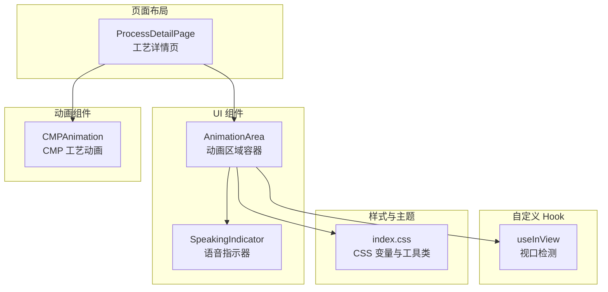
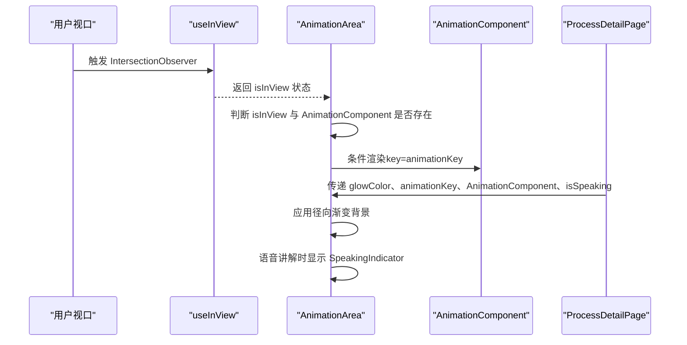
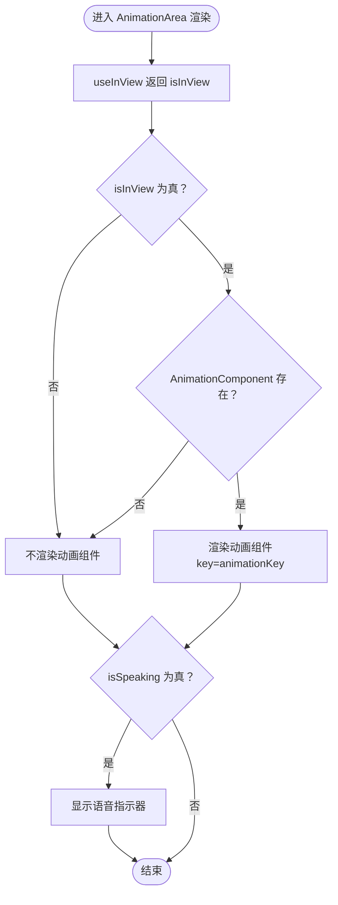
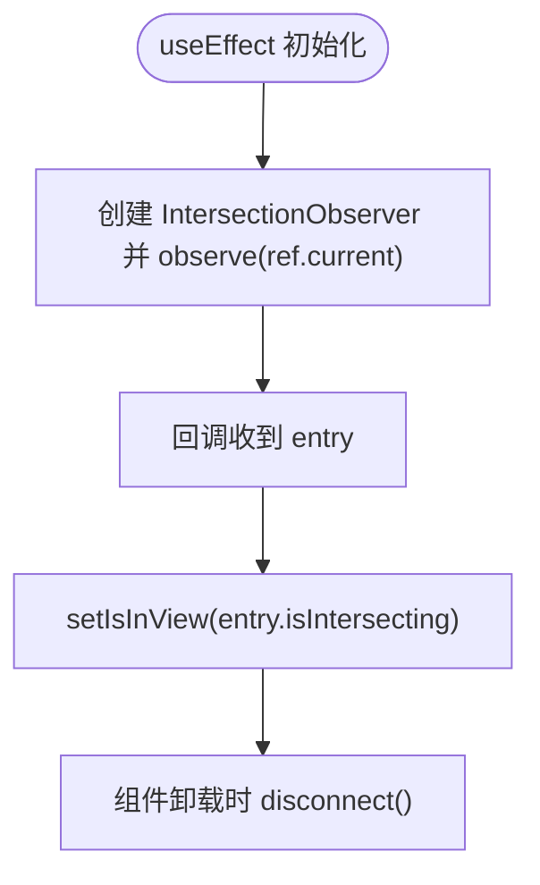
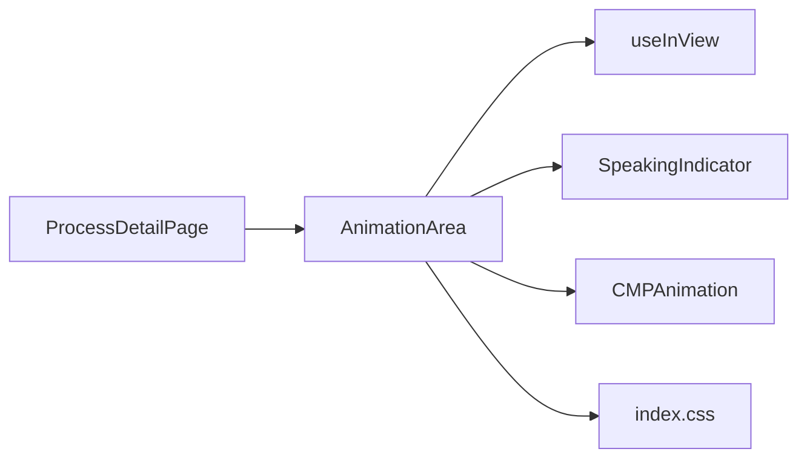

# 动画区域组件

<cite>
**本文引用的文件**
- [AnimationArea.tsx](file://src/components/ui/AnimationArea.tsx)
- [useInView.ts](file://src/hooks/useInView.ts)
- [SpeakingIndicator.tsx](file://src/components/ui/SpeakingIndicator.tsx)
- [ProcessDetailPage.tsx](file://src/components/layout/ProcessDetailPage.tsx)
- [CMP.tsx](file://src/components/process/CMP.tsx)
- [index.css](file://src/index.css)
- [useSpeech.ts](file://src/hooks/useSpeech.ts)
</cite>

## 目录
1. [简介](#简介)
2. [项目结构](#项目结构)
3. [核心组件](#核心组件)
4. [架构总览](#架构总览)
5. [详细组件分析](#详细组件分析)
6. [依赖关系分析](#依赖关系分析)
7. [性能考量](#性能考量)
8. [故障排查指南](#故障排查指南)
9. [结论](#结论)
10. [附录](#附录)

## 简介
本文件系统性解析动画区域组件（AnimationArea）的设计与实现，涵盖：
- SVG 动画容器的实现原理与渐变背景效果
- 动态加载机制与懒加载策略（Intersection Observer）
- 组件属性接口与渲染条件判断
- 使用示例、样式定制与响应式设计
- 性能优化建议、内存管理与最佳实践

## 项目结构
AnimationArea 所在模块位于 UI 层，配合自定义 Hook useInView 实现懒加载，与页面布局组件 ProcessDetailPage 协同工作，以 CMP 等具体动画组件作为动态加载内容。

图表来源
- [AnimationArea.tsx:11-28](file://src/components/ui/AnimationArea.tsx#L11-L28)
- [useInView.ts:8-31](file://src/hooks/useInView.ts#L8-L31)
- [ProcessDetailPage.tsx:200-205](file://src/components/layout/ProcessDetailPage.tsx#L200-L205)
- [CMP.tsx:1-125](file://src/components/process/CMP.tsx#L1-L125)
- [index.css:36-46](file://src/index.css#L36-L46)

章节来源
- [AnimationArea.tsx:1-29](file://src/components/ui/AnimationArea.tsx#L1-L29)
- [useInView.ts:1-32](file://src/hooks/useInView.ts#L1-L32)
- [ProcessDetailPage.tsx:1-200](file://src/components/layout/ProcessDetailPage.tsx#L1-L200)
- [CMP.tsx:1-125](file://src/components/process/CMP.tsx#L1-L125)
- [index.css:1-142](file://src/index.css#L1-L142)

## 核心组件
- AnimationArea：负责渲染动画区域容器、应用径向渐变背景、基于视口可见性条件渲染动态动画组件，并在语音讲解时显示语音指示器。
- useInView：封装 IntersectionObserver，提供 isInView 状态与 ref 引用，支持 threshold 与 rootMargin 配置。
- SpeakingIndicator：在动画区域底部显示脉冲式语音条形图与提示文本。
- ProcessDetailPage：页面级容器，负责根据路由参数选择对应动画组件并传入 AnimationArea。
- CMPAnimation：示例动画组件，展示 SVG 渐变、滤镜与 CSS 动画的组合使用。

章节来源
- [AnimationArea.tsx:4-9](file://src/components/ui/AnimationArea.tsx#L4-L9)
- [useInView.ts:3-6](file://src/hooks/useInView.ts#L3-L6)
- [SpeakingIndicator.tsx:3-27](file://src/components/ui/SpeakingIndicator.tsx#L3-L27)
- [ProcessDetailPage.tsx:23-34](file://src/components/layout/ProcessDetailPage.tsx#L23-L34)
- [CMP.tsx:1-125](file://src/components/process/CMP.tsx#L1-L125)

## 架构总览
AnimationArea 通过 useInView 获取 isInView 状态，仅当元素进入视口且存在动画组件时才渲染对应动画组件，从而实现懒加载。同时，组件接收 glowColor 与 animationKey，分别用于背景渐变与强制重新挂载动画组件。

图表来源
- [AnimationArea.tsx:11-28](file://src/components/ui/AnimationArea.tsx#L11-L28)
- [useInView.ts:15-28](file://src/hooks/useInView.ts#L15-L28)
- [ProcessDetailPage.tsx:200-205](file://src/components/layout/ProcessDetailPage.tsx#L200-L205)

## 详细组件分析

### AnimationArea 组件
- 设计要点
  - 使用 ref 与 useInView 的 isInView 状态控制动画组件的条件渲染，避免不必要的初始化与资源占用。
  - 背景采用径向渐变（ellipse at center）叠加 CSS 变量定义的卡片渐变，形成柔和的发光效果。
  - 通过 animationKey 强制更新子组件，确保在步骤切换或重播时重新挂载动画。
  - 在 isSpeaking 为真时显示语音指示器，增强交互反馈。
- 属性接口
  - glowColor: string —— 径向渐变中心色，决定动画区域的发光色彩。
  - animationKey: number —— 用于强制重新挂载动画组件的键值。
  - AnimationComponent: React.FC | null —— 动态加载的动画组件类型。
  - isSpeaking: boolean —— 语音讲解状态，控制语音指示器显示。
- 渲染逻辑
  - 当 isInView 为真且 AnimationComponent 存在时，渲染该组件。
  - 语音讲解时始终显示语音指示器。

图表来源
- [AnimationArea.tsx:11-28](file://src/components/ui/AnimationArea.tsx#L11-L28)

章节来源
- [AnimationArea.tsx:11-28](file://src/components/ui/AnimationArea.tsx#L11-L28)

### useInView Hook
- 设计要点
  - 基于 IntersectionObserver 实现，支持 threshold 与 rootMargin 配置，默认 threshold=0.1。
  - 在组件卸载时自动断开观察器，防止内存泄漏。
  - 返回 ref 与 isInView 状态，供上层组件直接使用。
- 性能与可调性
  - threshold 控制触发时机，较小值更早触发但可能增加渲染次数；较大值更保守，减少渲染但可能延迟动画出现。
  - rootMargin 可提前进入视口范围，提升体验。

图表来源
- [useInView.ts:15-28](file://src/hooks/useInView.ts#L15-L28)

章节来源
- [useInView.ts:8-31](file://src/hooks/useInView.ts#L8-L31)

### SpeakingIndicator 组件
- 设计要点
  - 使用 useMemo 生成随机高度的条形图，避免每次渲染重新计算。
  - 通过 CSS 动画实现脉冲发光效果，条形高度与延迟随索引变化，营造自然的音频可视化。
- 交互位置
  - 由 AnimationArea 在 isSpeaking 为真时显示，位于动画区域底部中央。

章节来源
- [SpeakingIndicator.tsx:3-27](file://src/components/ui/SpeakingIndicator.tsx#L3-L27)

### 动画组件（以 CMPAnimation 为例）
- 设计要点
  - 使用 SVG 定义渐变、滤镜与 CSS 动画，实现旋转、摆动、流动与发光等效果。
  - 通过 CSS 变量与动画延迟实现多元素同步与错峰效果。
- 与 AnimationArea 的协作
  - ProcessDetailPage 根据路由 id 选择对应动画组件并通过 AnimationArea 传入。
  - AnimationArea 仅在 isInView 且组件存在时渲染，避免首屏阻塞。

章节来源
- [CMP.tsx:1-125](file://src/components/process/CMP.tsx#L1-L125)
- [ProcessDetailPage.tsx:23-34](file://src/components/layout/ProcessDetailPage.tsx#L23-L34)

### 页面级集成（ProcessDetailPage）
- 设计要点
  - 通过 animationMap 将步骤 id 映射到对应的动画组件。
  - 使用 animationKey 控制动画组件的重新挂载，确保重播时动画重置。
  - 结合 useSpeech 提供语音讲解能力，isSpeaking 状态传递给 AnimationArea。
- 与 AnimationArea 的数据流
  - 传递 glowColor（来自步骤元数据）、animationKey、AnimationComponent、isSpeaking。

章节来源
- [ProcessDetailPage.tsx:23-34](file://src/components/layout/ProcessDetailPage.tsx#L23-L34)
- [ProcessDetailPage.tsx:200-205](file://src/components/layout/ProcessDetailPage.tsx#L200-L205)
- [useSpeech.ts:64-134](file://src/hooks/useSpeech.ts#L64-L134)

## 依赖关系分析
- AnimationArea 依赖 useInView 提供的 isInView 状态与 ref。
- AnimationArea 依赖 SpeakingIndicator 进行语音状态可视化。
- AnimationArea 依赖 ProcessDetailPage 传入的动态动画组件与 glowColor、animationKey、isSpeaking。
- 动态动画组件（如 CMPAnimation）依赖 CSS 变量与工具类实现统一风格与动画效果。

图表来源
- [AnimationArea.tsx:11-28](file://src/components/ui/AnimationArea.tsx#L11-L28)
- [ProcessDetailPage.tsx:200-205](file://src/components/layout/ProcessDetailPage.tsx#L200-L205)
- [index.css:36-46](file://src/index.css#L36-L46)

章节来源
- [AnimationArea.tsx:1-29](file://src/components/ui/AnimationArea.tsx#L1-L29)
- [ProcessDetailPage.tsx:1-200](file://src/components/layout/ProcessDetailPage.tsx#L1-L200)
- [index.css:1-142](file://src/index.css#L1-L142)

## 性能考量
- 懒加载策略
  - 使用 IntersectionObserver 与 threshold=0.1，在元素即将进入视口时开始渲染动画，降低首屏压力。
  - 建议在长列表或复杂动画场景中适当提高 threshold，减少过早渲染带来的抖动。
- 动画组件复用与重置
  - 通过 animationKey 强制重新挂载动画组件，确保状态重置；在频繁切换步骤时注意避免过度重置导致的闪烁。
- 资源释放
  - useInView 在组件卸载时自动断开观察器，避免内存泄漏。
- 语音讲解与动画并发
  - 语音讲解与动画渲染并存时，注意动画数量与复杂度，避免同时大量高开销动画造成卡顿。
- 主题与渐变
  - 背景使用 CSS 变量与径向渐变，避免在 JS 中频繁计算，提升渲染性能。

[本节为通用性能建议，无需特定文件引用]

## 故障排查指南
- 动画未出现
  - 检查 isInView 是否为真：确认元素是否在视口范围内，必要时调整 threshold 或 rootMargin。
  - 检查 AnimationComponent 是否为 null：确认 ProcessDetailPage 的 animationMap 是否包含对应 id。
- 动画无法重播
  - 确认 animationKey 是否递增：ProcessDetailPage 在步骤切换或重播时会增加 animationKey，确保组件被重新挂载。
- 语音指示器不显示
  - 检查 isSpeaking 状态：确认 useSpeech 的 speak/stop 流程是否正确触发。
- 渐变背景异常
  - 检查 glowColor 与 CSS 变量：确保传入的颜色值有效，且 index.css 中的 --gradient-card 正常生效。

章节来源
- [useInView.ts:15-28](file://src/hooks/useInView.ts#L15-L28)
- [ProcessDetailPage.tsx:94-98](file://src/components/layout/ProcessDetailPage.tsx#L94-L98)
- [useSpeech.ts:82-112](file://src/hooks/useSpeech.ts#L82-L112)
- [index.css:36-46](file://src/index.css#L36-L46)

## 结论
AnimationArea 通过 IntersectionObserver 实现懒加载，结合动态组件与渐变背景，提供了良好的用户体验与性能表现。其简洁的属性接口与清晰的数据流，便于在页面布局中灵活集成多种动画组件。配合 ProcessDetailPage 的步骤映射与 useSpeech 的语音讲解，形成完整的教学演示闭环。

[本节为总结性内容，无需特定文件引用]

## 附录

### 使用示例与最佳实践
- 动画组件集成
  - 在 ProcessDetailPage 的 animationMap 中注册步骤 id 与动画组件的映射。
  - 将步骤元数据中的 glowColor 传入 AnimationArea，确保背景与主题一致。
- 样式定制
  - 通过 CSS 变量（如 --gradient-card、--gradient-glow）统一主题风格。
  - 自定义径向渐变颜色时，确保与 glowColor 保持视觉协调。
- 响应式设计
  - AnimationArea 使用 aspect-[16/10] 保证固定宽高比，适配不同屏幕尺寸。
  - 在移动端可通过容器宽度自适应，保持动画比例不变。
- 性能优化建议
  - 合理设置 threshold 与 rootMargin，平衡首屏加载与交互体验。
  - 控制 animationKey 更新频率，避免不必要的组件重挂载。
  - 对复杂动画进行分段或按需播放，减少同时运行的动画数量。

章节来源
- [ProcessDetailPage.tsx:23-34](file://src/components/layout/ProcessDetailPage.tsx#L23-L34)
- [AnimationArea.tsx:17-20](file://src/components/ui/AnimationArea.tsx#L17-L20)
- [index.css:36-46](file://src/index.css#L36-L46)