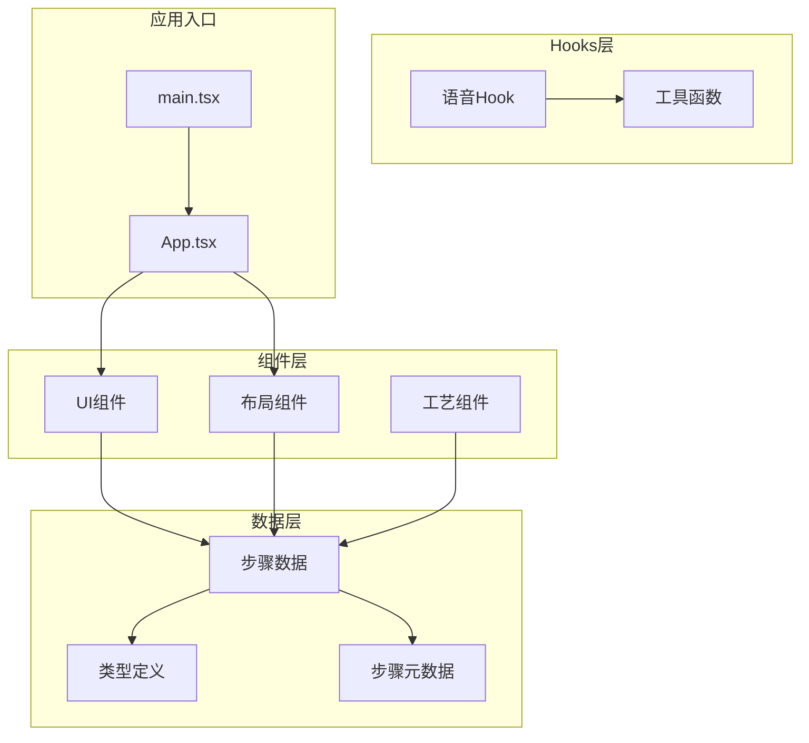
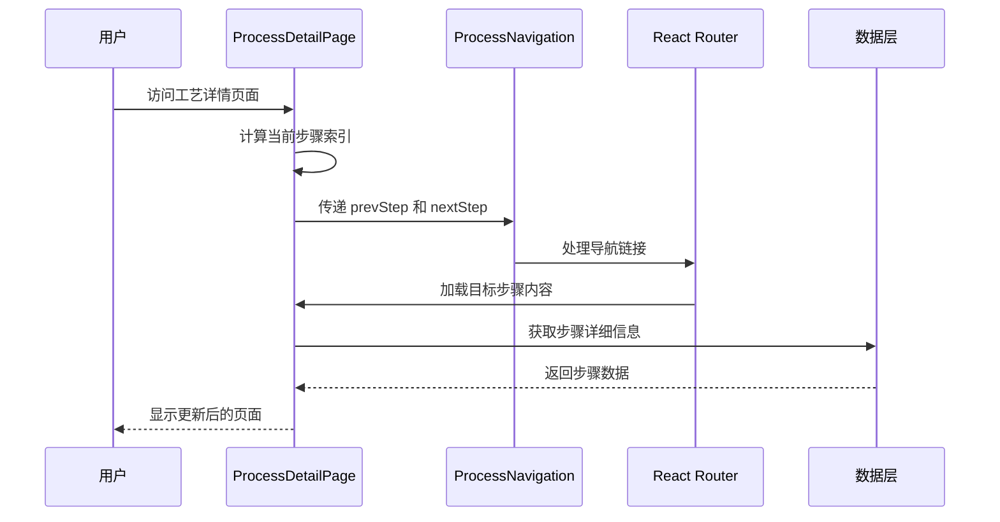
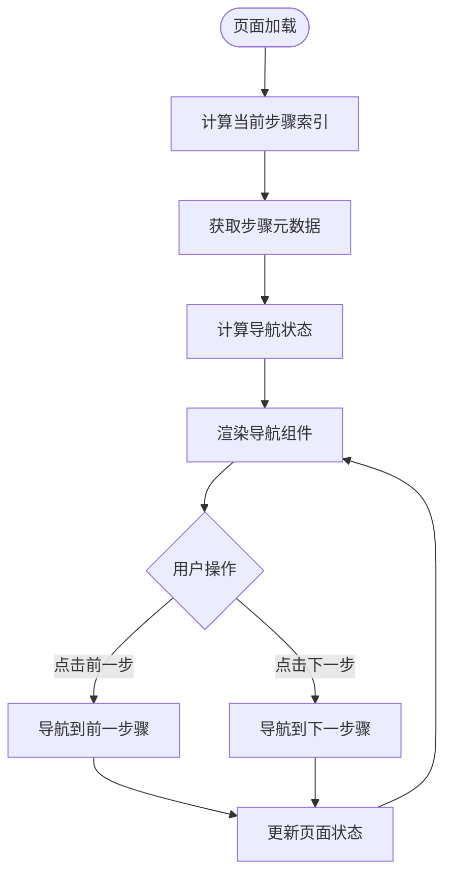
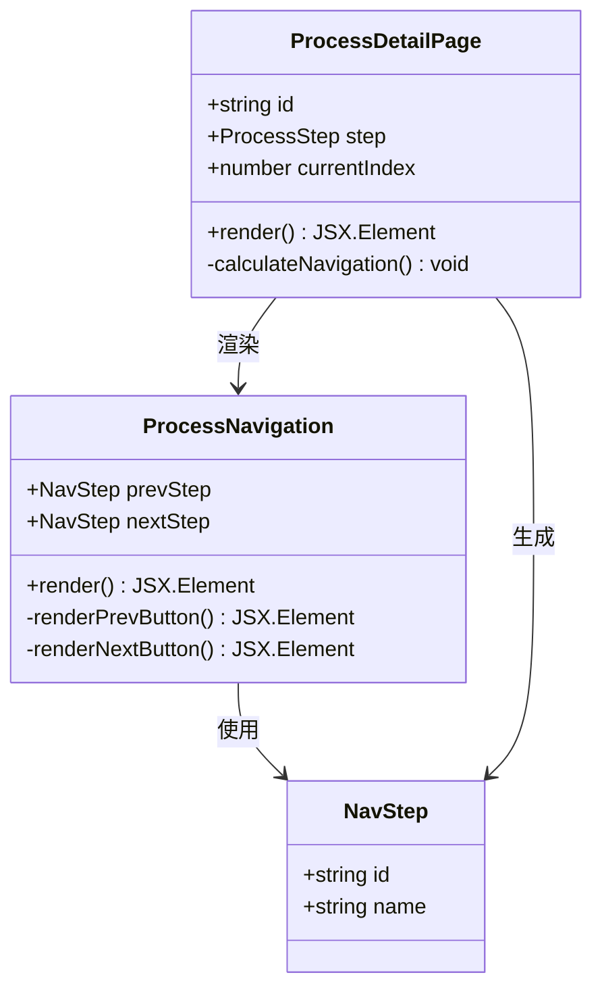
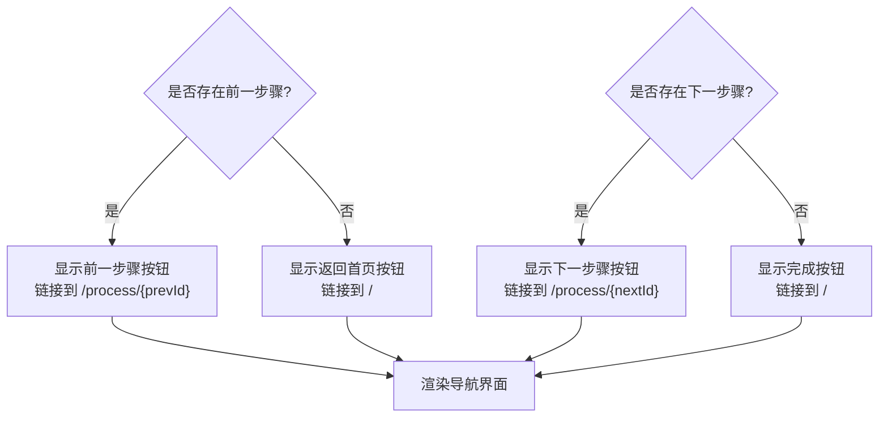
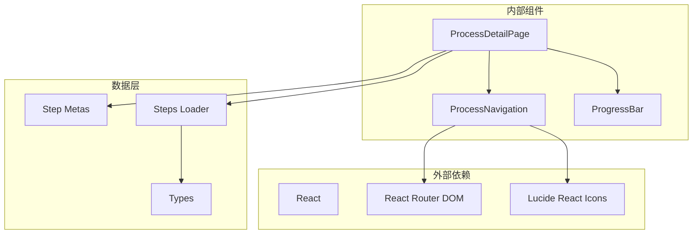

# 工艺导航组件

<cite>
**本文档引用的文件**
- [ProcessNavigation.tsx](file://src/components/ui/ProcessNavigation.tsx)
- [ProcessDetailPage.tsx](file://src/components/layout/ProcessDetailPage.tsx)
- [HomePage.tsx](file://src/components/layout/HomePage.tsx)
- [index.ts](file://src/data/steps/index.ts)
- [types.ts](file://src/data/types.ts)
- [stepMetas.ts](file://src/data/stepMetas.ts)
- [ProgressBar.tsx](file://src/components/ui/ProgressBar.tsx)
- [useSpeech.ts](file://src/hooks/useSpeech.ts)
- [utils.ts](file://src/lib/utils.ts)
</cite>

## 目录
1. [简介](#简介)
2. [项目结构](#项目结构)
3. [核心组件](#核心组件)
4. [架构概览](#架构概览)
5. [详细组件分析](#详细组件分析)
6. [依赖关系分析](#依赖关系分析)
7. [性能考虑](#性能考虑)
8. [故障排除指南](#故障排除指南)
9. [结论](#结论)
10. [附录](#附录)

## 简介

工艺导航组件是一个专门为芯片制造流程展示应用设计的导航系统，它提供了直观的步骤导航功能，帮助用户在复杂的半导体制造工艺流程中进行流畅的浏览和探索。该组件不仅实现了基本的前后步骤切换功能，还集成了丰富的视觉反馈和用户体验优化。

该组件基于React和TypeScript构建，采用了现代化的前端开发实践，包括TypeScript类型安全、React Hooks状态管理、以及Tailwind CSS样式系统。组件设计遵循了响应式布局原则，能够在不同设备和屏幕尺寸上提供一致的用户体验。

## 项目结构

该项目采用模块化的文件组织方式，将功能按层次和职责进行分离：



**图表来源**
- [ProcessNavigation.tsx:1-67](file://src/components/ui/ProcessNavigation.tsx#L1-L67)
- [ProcessDetailPage.tsx:1-397](file://src/components/layout/ProcessDetailPage.tsx#L1-L397)
- [HomePage.tsx:1-85](file://src/components/layout/HomePage.tsx#L1-L85)

**章节来源**
- [ProcessNavigation.tsx:1-67](file://src/components/ui/ProcessNavigation.tsx#L1-L67)
- [ProcessDetailPage.tsx:1-397](file://src/components/layout/ProcessDetailPage.tsx#L1-L397)
- [HomePage.tsx:1-85](file://src/components/layout/HomePage.tsx#L1-L85)

## 核心组件

### ProcessNavigation 组件

ProcessNavigation 是一个专门设计的导航组件，负责处理芯片制造工艺流程中的步骤导航。该组件接收前一步骤和下一步骤的信息，并提供相应的导航界面。

#### 组件接口设计

组件通过清晰的接口定义来确保类型安全和良好的开发体验：

```typescript
interface NavStep {
  id: string;
  name: string;
}

interface ProcessNavigationProps {
  prevStep: NavStep | null;
  nextStep: NavStep | null;
}
```

#### 导航逻辑实现

组件实现了智能的导航逻辑，能够根据当前步骤的位置动态调整导航按钮的状态：

- **前一步骤导航**：当存在前一步骤时，显示带有返回箭头的链接按钮；当不存在时，显示返回首页的按钮
- **下一步骤导航**：当存在下一步骤时，显示带有前进箭头的强调按钮；当不存在时，显示完成按钮并跳转到首页

#### 视觉设计特点

组件采用了对比鲜明的设计风格：
- 前一步骤使用浅色边框和悬停效果，营造温和的导航氛围
- 下一步骤使用强调色背景，突出前进的方向性
- 所有按钮都包含图标和文字说明，提供清晰的视觉指示

**章节来源**
- [ProcessNavigation.tsx:4-12](file://src/components/ui/ProcessNavigation.tsx#L4-L12)
- [ProcessNavigation.tsx:14-66](file://src/components/ui/ProcessNavigation.tsx#L14-L66)

## 架构概览

该组件在整个应用架构中扮演着关键的角色，它与多个其他组件和数据层紧密协作：



**图表来源**
- [ProcessDetailPage.tsx:51-55](file://src/components/layout/ProcessDetailPage.tsx#L51-L55)
- [ProcessNavigation.tsx:14-66](file://src/components/ui/ProcessNavigation.tsx#L14-L66)

### 状态管理机制

组件采用声明式状态管理模式，通过props传递数据，避免了复杂的本地状态管理：

1. **外部状态驱动**：导航状态完全由父组件计算并传递
2. **无副作用设计**：组件不直接修改任何外部状态
3. **类型安全保障**：完整的TypeScript类型定义确保数据正确性

### 数据流分析



**图表来源**
- [ProcessDetailPage.tsx:51-55](file://src/components/layout/ProcessDetailPage.tsx#L51-L55)
- [ProcessDetailPage.tsx:59-67](file://src/components/layout/ProcessDetailPage.tsx#L59-L67)

**章节来源**
- [ProcessDetailPage.tsx:51-67](file://src/components/layout/ProcessDetailPage.tsx#L51-L67)

## 详细组件分析

### 类结构分析



**图表来源**
- [ProcessNavigation.tsx:4-12](file://src/components/ui/ProcessNavigation.tsx#L4-L12)
- [ProcessDetailPage.tsx:36-55](file://src/components/layout/ProcessDetailPage.tsx#L36-L55)

### 导航功能实现

#### 步骤切换逻辑

组件实现了智能的步骤切换功能，能够根据当前步骤在流程中的位置动态调整导航行为：



**图表来源**
- [ProcessNavigation.tsx:17-39](file://src/components/ui/ProcessNavigation.tsx#L17-L39)
- [ProcessNavigation.tsx:41-63](file://src/components/ui/ProcessNavigation.tsx#L41-L63)

#### 当前位置标识

组件通过路由参数和步骤元数据的结合来确定当前位置：

1. **路由参数解析**：从URL中提取当前步骤的ID
2. **元数据匹配**：在步骤元数据数组中查找对应的位置
3. **边界条件处理**：处理首尾步骤的特殊情况

#### 历史记录管理

虽然组件本身不直接管理浏览器历史记录，但它通过标准的HTML链接实现了自然的历史记录行为：

- 每次导航都会创建新的历史记录条目
- 支持浏览器的前进后退功能
- 保持良好的SEO友好性

**章节来源**
- [ProcessNavigation.tsx:17-63](file://src/components/ui/ProcessNavigation.tsx#L17-L63)
- [ProcessDetailPage.tsx:51-55](file://src/components/layout/ProcessDetailPage.tsx#L51-L55)

### 视觉设计分析

#### 步骤指示器设计

组件采用了简洁而有效的视觉设计原则：

- **颜色编码**：使用不同的颜色来区分前一步骤和下一步骤
- **图标系统**：箭头图标提供明确的方向指示
- **文本层次**：通过字体大小和颜色区分标题和说明文字
- **响应式布局**：适配不同屏幕尺寸的显示需求

#### 连接线和布局

虽然导航组件本身不直接绘制连接线，但其设计与整体页面布局形成了协调的视觉效果：

- **水平居中**：导航按钮水平排列，居中显示
- **间距统一**：按钮之间保持适当的间距
- **对齐一致**：所有元素采用统一的对齐方式

#### 标签文本布局

组件在文本布局上采用了层次化的设计：

1. **说明文字**：使用较小的字体显示"上一步"、"下一步"等说明
2. **步骤名称**：使用较大的字体显示具体的步骤名称
3. **颜色对比**：通过颜色对比确保文本的可读性

**章节来源**
- [ProcessNavigation.tsx:16-66](file://src/components/ui/ProcessNavigation.tsx#L16-L66)

### 配置选项分析

#### 步骤数据绑定

组件通过props接收步骤数据，支持灵活的数据绑定：

- **可选步骤**：prevStep和nextStep都支持null值，处理边界情况
- **类型安全**：完整的TypeScript类型定义确保数据正确性
- **扩展性**：可以轻松扩展以支持更多步骤属性

#### 导航回调函数

虽然组件本身不提供回调函数，但可以通过以下方式实现自定义行为：

- **自定义链接**：通过包装组件实现自定义导航逻辑
- **事件监听**：在父组件中监听导航事件
- **状态同步**：通过props传递状态变化

#### 样式定制方案

组件支持多种样式定制方式：

- **Tailwind CSS类**：通过className属性添加自定义样式
- **CSS变量**：支持通过CSS变量进行主题定制
- **组件组合**：通过组合其他UI组件实现复杂样式

**章节来源**
- [ProcessNavigation.tsx:9-12](file://src/components/ui/ProcessNavigation.tsx#L9-L12)

## 依赖关系分析

### 组件间依赖



**图表来源**
- [ProcessNavigation.tsx:1-2](file://src/components/ui/ProcessNavigation.tsx#L1-L2)
- [ProcessDetailPage.tsx:1-21](file://src/components/layout/ProcessDetailPage.tsx#L1-L21)

### 数据依赖分析

组件的数据依赖关系相对简单，主要依赖于步骤元数据和路由系统：

1. **步骤元数据依赖**：通过processStepMetas获取步骤列表
2. **路由依赖**：使用React Router进行页面导航
3. **图标依赖**：使用Lucide React图标库

### 循环依赖检查

经过分析，该组件没有发现循环依赖问题：
- ProcessNavigation是纯展示组件，不依赖其他组件
- 依赖关系都是单向的，从父组件到子组件
- 数据层与UI层分离良好

**章节来源**
- [ProcessNavigation.tsx:1-2](file://src/components/ui/ProcessNavigation.tsx#L1-L2)
- [ProcessDetailPage.tsx:1-21](file://src/components/layout/ProcessDetailPage.tsx#L1-L21)

## 性能考虑

### 渲染性能优化

组件采用了轻量级的设计，具有良好的渲染性能：

- **无状态组件**：使用函数组件减少内存开销
- **最小化重渲染**：通过props传递数据，避免不必要的状态更新
- **纯函数渲染**：render方法不产生副作用

### 内存使用分析

组件的内存使用相对较低：
- 无本地状态存储
- 无定时器或事件监听器
- 无大型数据结构

### 网络性能

组件在网络方面的表现良好：
- 不会发起额外的网络请求
- 依赖外部资源（图标库）按需加载
- 支持缓存机制

## 故障排除指南

### 常见问题诊断

#### 导航链接失效

**症状**：导航按钮点击无效
**可能原因**：
- 步骤ID不正确
- 路由配置错误
- 步骤元数据缺失

**解决方法**：
1. 检查步骤ID是否存在于步骤元数据中
2. 验证路由配置是否正确
3. 确认步骤元数据的完整性

#### 样式显示异常

**症状**：导航按钮样式不符合预期
**可能原因**：
- Tailwind CSS类名冲突
- 主题配置问题
- 浏览器兼容性问题

**解决方法**：
1. 检查CSS类名的正确性
2. 验证主题配置
3. 测试不同浏览器的兼容性

#### 响应式布局问题

**症状**：在移动设备上显示异常
**可能原因**：
- 断点设置不当
- 元视口配置问题
- 字体大小设置

**解决方法**：
1. 调整断点设置
2. 检查元视口配置
3. 优化移动端字体大小

**章节来源**
- [ProcessNavigation.tsx:14-66](file://src/components/ui/ProcessNavigation.tsx#L14-L66)

## 结论

工艺导航组件是一个设计精良、功能完备的导航系统，它成功地解决了芯片制造流程展示应用中的导航需求。组件具有以下突出特点：

### 技术优势

1. **类型安全**：完整的TypeScript类型定义确保了代码的可靠性
2. **简洁设计**：函数式组件设计减少了复杂性
3. **响应式布局**：良好的移动端适配能力
4. **可维护性**：清晰的代码结构和模块化设计

### 用户体验优化

1. **直观导航**：清晰的前后步骤指示
2. **视觉反馈**：丰富的颜色和图标提示
3. **一致性**：与整体应用设计风格保持一致
4. **无障碍访问**：支持键盘导航和屏幕阅读器

### 扩展性考虑

组件设计具有良好的扩展性：
- 可以轻松添加新的导航状态
- 支持自定义样式和主题
- 可以与其他导航组件组合使用

该组件为整个芯片制造流程展示应用提供了坚实的基础，为用户提供了流畅、直观的导航体验。

## 附录

### 使用示例

#### 基本使用

```typescript
// 在工艺详情页面中使用
<ProcessNavigation 
  prevStep={prevStep} 
  nextStep={nextStep} 
/>
```

#### 自定义样式

```typescript
// 通过className属性添加自定义样式
<ProcessNavigation 
  prevStep={prevStep} 
  nextStep={nextStep} 
  className="custom-navigation"
/>
```

### 集成方法

#### 与路由系统的集成

组件与React Router无缝集成，自动处理导航逻辑：

1. **路由参数**：通过URL参数传递步骤ID
2. **导航处理**：使用标准的HTML链接进行导航
3. **状态同步**：通过props传递导航状态

#### 与数据层的集成

组件通过步骤元数据和步骤详情数据实现完整的导航功能：

1. **步骤元数据**：提供步骤的基本信息和顺序
2. **步骤详情**：提供步骤的详细内容
3. **状态计算**：父组件负责计算导航状态

### 用户体验优化建议

1. **加载状态处理**：为异步数据加载提供合适的加载指示器
2. **错误处理**：为导航失败提供友好的错误提示
3. **性能监控**：监控组件的渲染性能和内存使用
4. **可访问性改进**：添加ARIA标签和键盘导航支持