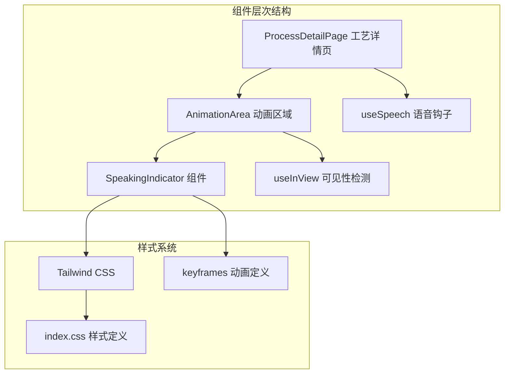
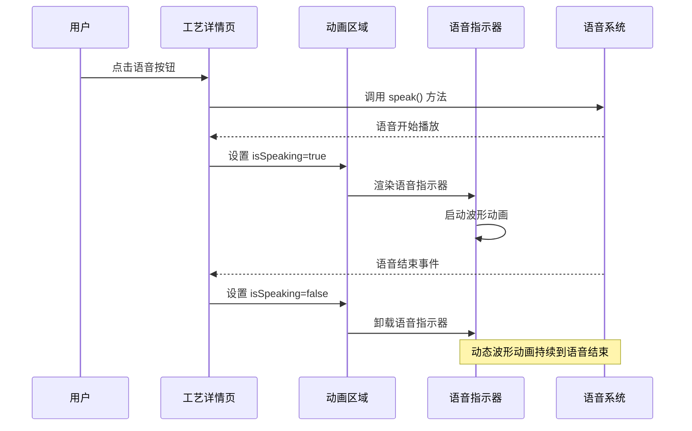
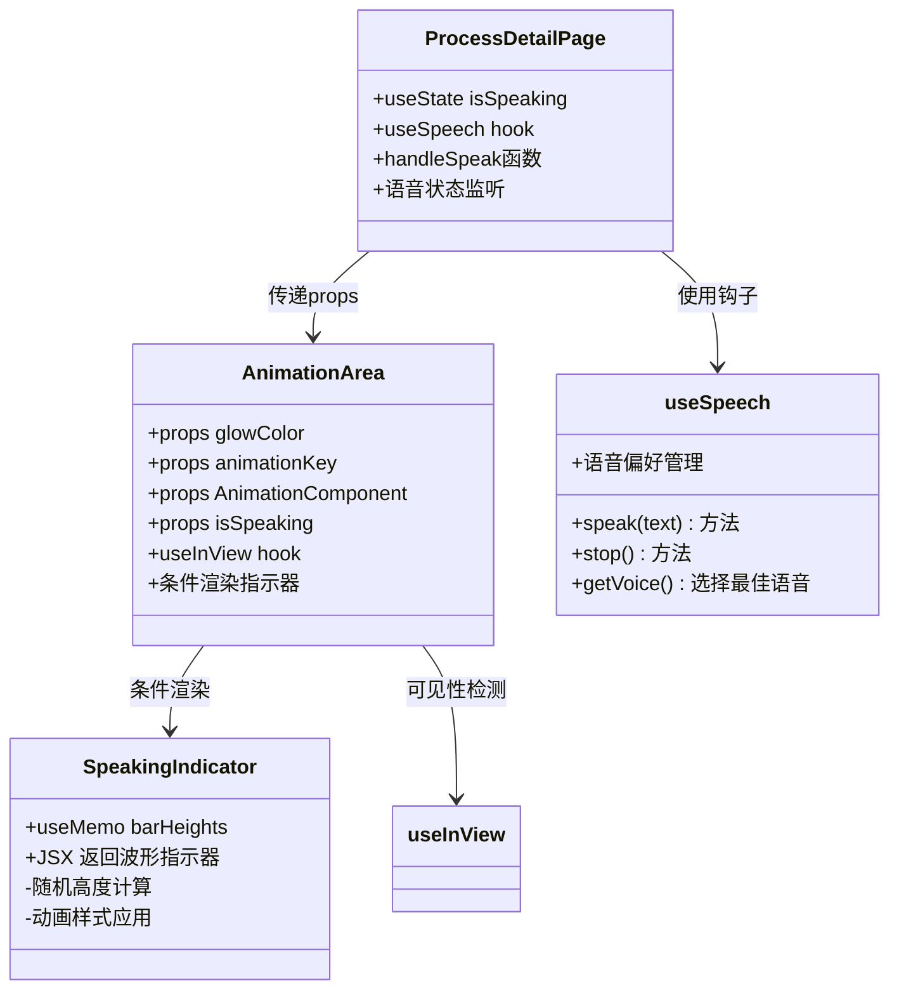
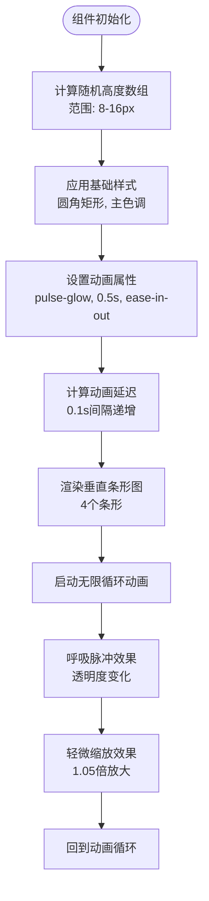
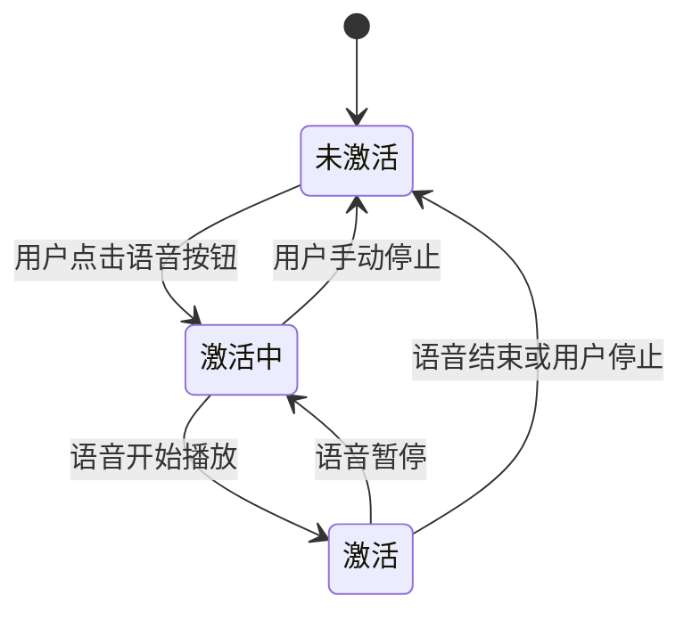
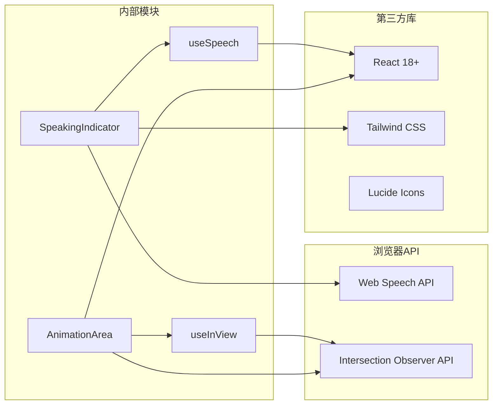

# 语音指示器组件

<cite>
**本文档引用的文件**
- [SpeakingIndicator.tsx](file://src/components/ui/SpeakingIndicator.tsx)
- [useSpeech.ts](file://src/hooks/useSpeech.ts)
- [AnimationArea.tsx](file://src/components/ui/AnimationArea.tsx)
- [ProcessDetailPage.tsx](file://src/components/layout/ProcessDetailPage.tsx)
- [useInView.ts](file://src/hooks/useInView.ts)
- [tailwind.config.ts](file://tailwind.config.ts)
- [index.css](file://src/index.css)
</cite>

## 目录
1. [简介](#简介)
2. [项目结构](#项目结构)
3. [核心组件](#核心组件)
4. [架构概览](#架构概览)
5. [详细组件分析](#详细组件分析)
6. [依赖关系分析](#依赖关系分析)
7. [性能考虑](#性能考虑)
8. [故障排除指南](#故障排除指南)
9. [结论](#结论)
10. [附录](#附录)

## 简介

语音指示器组件是芯片制造演示应用中的一个关键UI元素，用于在语音讲解过程中为用户提供视觉反馈。该组件实现了动态波形动画效果，通过垂直条形图的形式模拟语音播放时的声音强度变化，为用户提供了直观的语音状态指示。

该组件采用现代前端技术栈构建，结合了React Hooks、CSS动画和Web Speech API，实现了流畅的用户体验和良好的可访问性支持。

## 项目结构

语音指示器组件位于项目的UI组件目录中，与语音系统和动画区域组件协同工作：

**图表来源**
- [SpeakingIndicator.tsx:1-28](file://src/components/ui/SpeakingIndicator.tsx#L1-L28)
- [AnimationArea.tsx:1-29](file://src/components/ui/AnimationArea.tsx#L1-L29)
- [ProcessDetailPage.tsx:36-108](file://src/components/layout/ProcessDetailPage.tsx#L36-L108)

**章节来源**
- [SpeakingIndicator.tsx:1-28](file://src/components/ui/SpeakingIndicator.tsx#L1-L28)
- [AnimationArea.tsx:1-29](file://src/components/ui/AnimationArea.tsx#L1-L29)
- [ProcessDetailPage.tsx:36-108](file://src/components/layout/ProcessDetailPage.tsx#L36-L108)

## 核心组件

### SpeakingIndicator 组件

SpeakingIndicator组件是整个语音指示系统的核心，负责渲染动态波形动画效果。该组件具有以下关键特性：

- **动态波形生成**：使用随机高度的垂直条形图模拟声音波形
- **渐进式动画**：每个条形具有不同的延迟，创造连续的脉冲效果
- **响应式设计**：基于Tailwind CSS类名实现自适应布局
- **视觉反馈**：结合背景模糊和边框实现现代化外观

组件的核心实现逻辑包括：
1. 使用useMemo计算随机高度数组，确保组件重新渲染时保持一致的波形模式
2. 应用CSS pulse-glow动画实现呼吸效果
3. 通过animationDelay属性创建时序差异
4. 集成中文语音讲解文本提示

**章节来源**
- [SpeakingIndicator.tsx:3-27](file://src/components/ui/SpeakingIndicator.tsx#L3-L27)

## 架构概览

语音指示器组件在整个应用架构中扮演着重要的角色，与多个系统组件协同工作：

**图表来源**
- [ProcessDetailPage.tsx:82-108](file://src/components/layout/ProcessDetailPage.tsx#L82-L108)
- [AnimationArea.tsx:11-25](file://src/components/ui/AnimationArea.tsx#L11-L25)
- [useSpeech.ts:74-107](file://src/hooks/useSpeech.ts#L74-L107)

### 系统集成点

组件与应用其他部分的集成关系：

1. **状态管理集成**：通过isSpeaking布尔值控制组件显示/隐藏
2. **动画区域集成**：作为AnimationArea的子组件渲染
3. **语音系统集成**：依赖useSpeech钩子提供的语音控制功能
4. **可见性检测集成**：与useInView钩子协作优化性能

**章节来源**
- [ProcessDetailPage.tsx:38-108](file://src/components/layout/ProcessDetailPage.tsx#L38-L108)
- [AnimationArea.tsx:11-25](file://src/components/ui/AnimationArea.tsx#L11-L25)

## 详细组件分析

### 组件实现架构

**图表来源**
- [SpeakingIndicator.tsx:3-27](file://src/components/ui/SpeakingIndicator.tsx#L3-L27)
- [AnimationArea.tsx:4-9](file://src/components/ui/AnimationArea.tsx#L4-L9)
- [ProcessDetailPage.tsx:38-108](file://src/components/layout/ProcessDetailPage.tsx#L38-L108)
- [useSpeech.ts:64-134](file://src/hooks/useSpeech.ts#L64-L134)

### 动画实现机制

语音指示器的动画效果通过CSS keyframes和JavaScript控制相结合实现：

#### 波形动画算法

**图表来源**
- [SpeakingIndicator.tsx:4-7](file://src/components/ui/SpeakingIndicator.tsx#L4-L7)
- [SpeakingIndicator.tsx:16-21](file://src/components/ui/SpeakingIndicator.tsx#L16-L21)

#### CSS动画配置

组件使用的动画系统基于Tailwind CSS的keyframes定义：

| 动画名称 | 持续时间 | 缓动函数 | 循环次数 |
|---------|---------|---------|---------|
| pulse-glow | 0.5秒 | ease-in-out | 无限次 |
| 呼吸效果 | 1.0秒 | ease-in-out | 无限次 |
| 缩放效果 | 0.5秒 | ease-in-out | 无限次 |

**章节来源**
- [SpeakingIndicator.tsx:16-21](file://src/components/ui/SpeakingIndicator.tsx#L16-L21)
- [tailwind.config.ts:67-71](file://tailwind.config.ts#L67-L71)

### 视觉设计系统

语音指示器采用统一的设计语言，与应用整体视觉风格保持一致：

#### 颜色系统

组件使用CSS变量定义的颜色方案：

| 颜色类别 | 变量名 | 实际值 | 用途 |
|---------|--------|-------|------|
| 主色调 | --primary | hsl(187, 85%, 53%) | 波形颜色, 文本颜色 |
| 背景 | --primary/20 | 20%不透明度 | 指示器背景 |
| 边框 | --primary/30 | 30%不透明度 | 指示器边框 |
| 高光 | --chip-glow | hsl(187, 85%, 70%) | 发光效果 |

#### 布局特性

- **定位系统**：绝对定位，底部居中，使用负偏移实现精确居中
- **尺寸规格**：圆角矩形，内边距适中，外边距紧凑
- **视觉层次**：背景模糊，半透明，发光边框增强立体感
- **响应式设计**：基于Flexbox布局，自动适应容器宽度

**章节来源**
- [SpeakingIndicator.tsx:10-25](file://src/components/ui/SpeakingIndicator.tsx#L10-L25)
- [index.css:13-46](file://src/index.css#L13-L46)

### 状态管理机制

组件的状态管理通过React的useState和useEffect实现：

**图表来源**
- [ProcessDetailPage.tsx:82-108](file://src/components/layout/ProcessDetailPage.tsx#L82-L108)

**章节来源**
- [ProcessDetailPage.tsx:39-91](file://src/components/layout/ProcessDetailPage.tsx#L39-L91)

## 依赖关系分析

### 外部依赖

语音指示器组件依赖于多个外部库和浏览器API：

**图表来源**
- [useSpeech.ts:74-107](file://src/hooks/useSpeech.ts#L74-L107)
- [useInView.ts:19-27](file://src/hooks/useInView.ts#L19-L27)

### 内部依赖关系

组件间的依赖关系体现了清晰的分层架构：

1. **AnimationArea** 作为父组件，负责：
   - 可见性检测（useInView）
   - 条件渲染控制
   - 父组件状态传递

2. **SpeakingIndicator** 作为子组件，负责：
   - 视觉效果渲染
   - 动画状态管理
   - 样式应用

3. **ProcessDetailPage** 作为容器组件，负责：
   - 语音状态管理
   - 事件处理
   - 生命周期管理

**章节来源**
- [AnimationArea.tsx:11-25](file://src/components/ui/AnimationArea.tsx#L11-L25)
- [ProcessDetailPage.tsx:38-108](file://src/components/layout/ProcessDetailPage.tsx#L38-L108)

## 性能考虑

### 渲染优化

语音指示器组件采用了多项性能优化策略：

1. **useMemo优化**：使用useMemo缓存随机高度计算结果，避免不必要的重渲染
2. **条件渲染**：仅在isSpeaking为true时渲染组件，减少DOM节点数量
3. **动画性能**：使用transform和opacity属性进行动画，利用GPU加速
4. **内存管理**：组件卸载时自动清理动画，防止内存泄漏

### 动画性能分析

| 动画属性 | 性能影响 | 优化策略 |
|---------|---------|---------|
| transform | 高 | GPU加速，硬件加速 |
| opacity | 高 | 硬件加速，无重排 |
| animation-delay | 低 | CSS层处理，无JavaScript干预 |
| background | 中 | CSS层处理，无重绘 |

### 可访问性优化

组件遵循了现代Web可访问性标准：

1. **运动偏好**：尊重用户的减少运动偏好设置
2. **键盘导航**：支持键盘操作触发语音功能
3. **屏幕阅读器**：提供适当的语义化标记
4. **对比度**：确保足够的颜色对比度

**章节来源**
- [SpeakingIndicator.tsx:4-7](file://src/components/ui/SpeakingIndicator.tsx#L4-L7)
- [index.css:133-141](file://src/index.css#L133-L141)

## 故障排除指南

### 常见问题及解决方案

#### 语音指示器不显示

**可能原因**：
1. isSpeaking状态未正确设置
2. AnimationArea未正确传递props
3. 浏览器不支持Web Speech API

**解决方法**：
1. 检查ProcessDetailPage中的handleSpeak函数
2. 验证AnimationArea的props传递
3. 在浏览器控制台检查Web Speech API支持

#### 动画效果异常

**可能原因**：
1. CSS动画未正确加载
2. Tailwind CSS配置问题
3. 浏览器兼容性问题

**解决方法**：
1. 检查tailwind.config.ts中的keyframes定义
2. 验证CSS类名拼写
3. 测试不同浏览器的兼容性

#### 性能问题

**可能原因**：
1. 频繁的状态更新
2. 不必要的组件重渲染
3. 动画帧率过低

**解决方法**：
1. 使用React DevTools分析渲染性能
2. 检查useMemo和useCallback的使用
3. 优化动画属性的计算

**章节来源**
- [ProcessDetailPage.tsx:82-108](file://src/components/layout/ProcessDetailPage.tsx#L82-L108)
- [tailwind.config.ts:67-71](file://tailwind.config.ts#L67-L71)

## 结论

语音指示器组件是一个精心设计的UI组件，成功地将语音状态可视化。该组件通过以下特点展现了优秀的工程实践：

1. **架构清晰**：组件职责明确，依赖关系清晰
2. **性能优化**：采用多种优化策略确保流畅体验
3. **可维护性**：代码结构良好，易于理解和扩展
4. **可访问性**：遵循现代Web标准，支持各种用户需求

该组件为芯片制造演示应用提供了重要的用户体验增强，通过直观的视觉反馈帮助用户更好地理解语音讲解内容。

## 附录

### 配置选项参考

| 属性名 | 类型 | 默认值 | 描述 |
|-------|------|--------|------|
| isSpeaking | boolean | false | 控制组件显示状态 |
| glowColor | string | 无 | 动画区域发光颜色 |
| animationKey | number | 0 | 强制重新渲染的键值 |
| barHeights | number[] | [8-16px] | 波形条形高度数组 |

### 最佳实践建议

1. **样式定制**：通过CSS变量和Tailwind类名进行样式定制
2. **性能监控**：定期检查组件的渲染性能和内存使用
3. **兼容性测试**：在不同浏览器和设备上测试组件表现
4. **可访问性验证**：使用自动化工具和人工测试验证可访问性