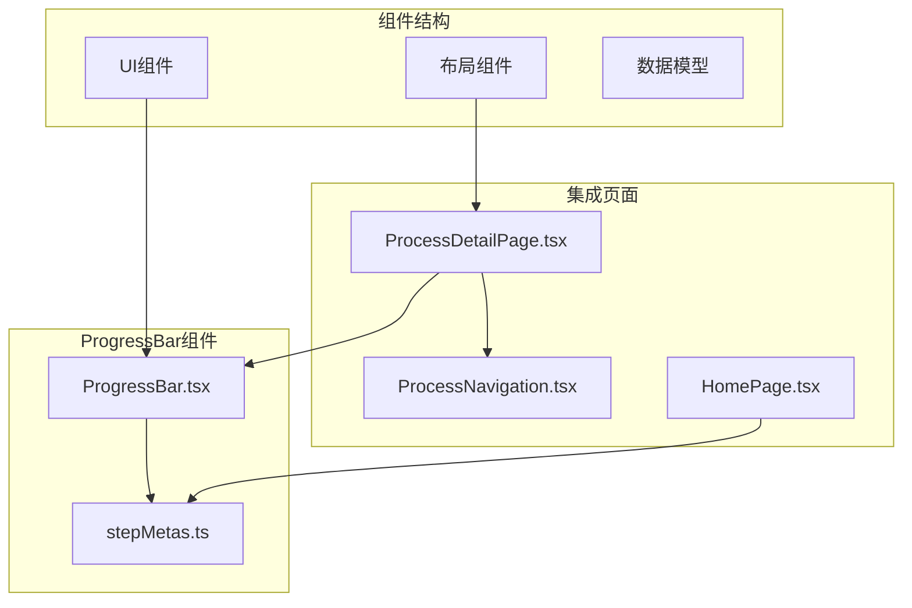
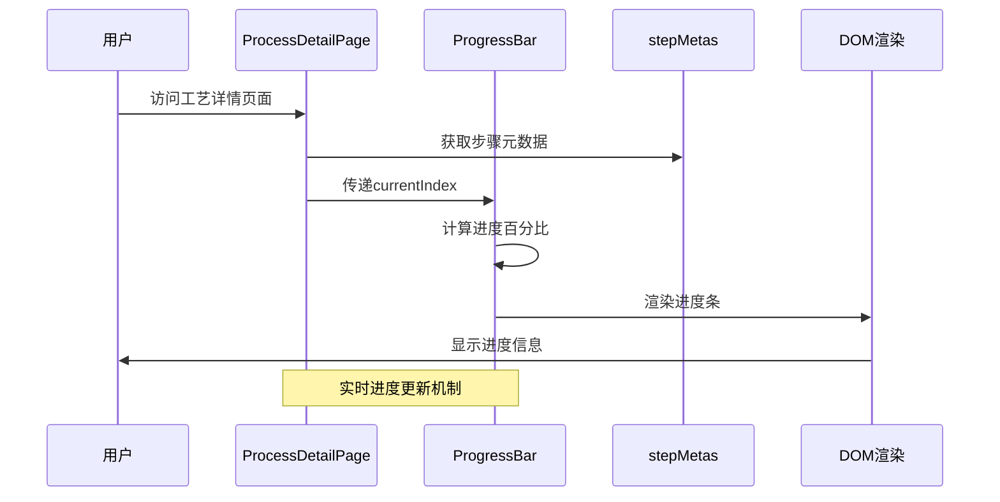
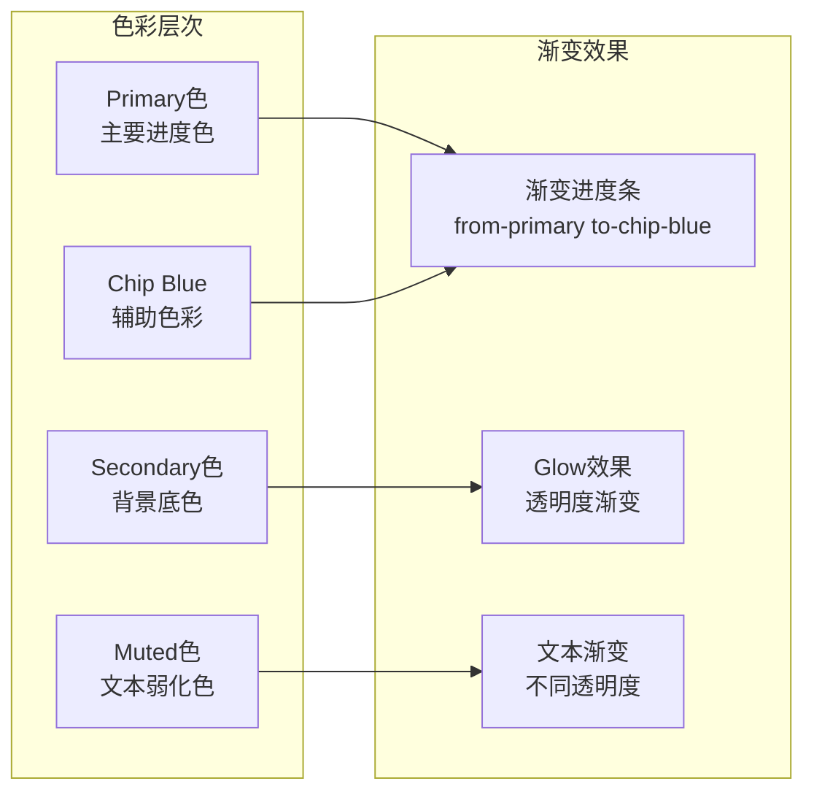
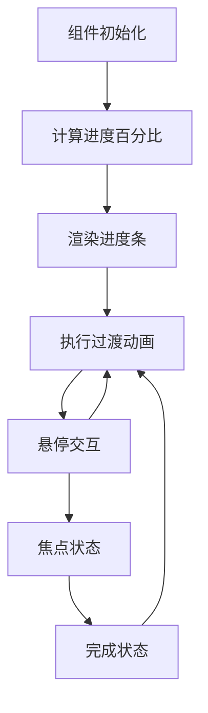
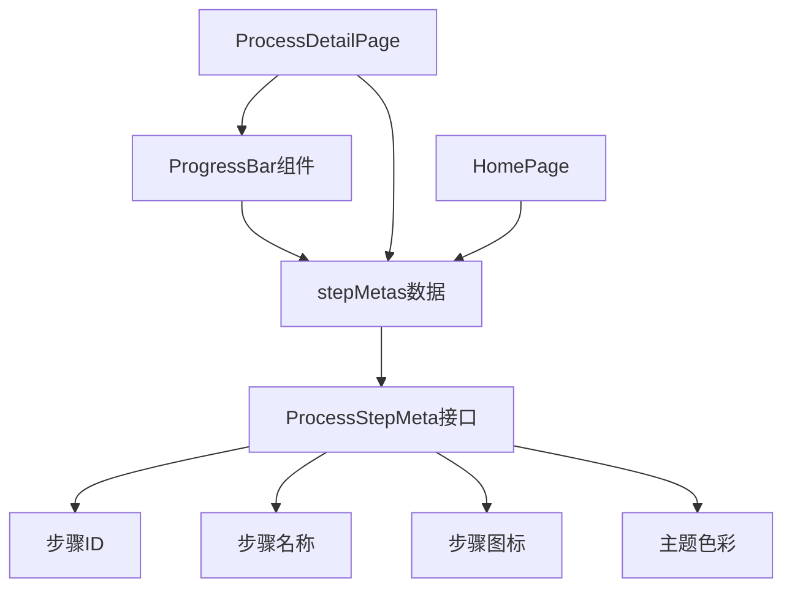
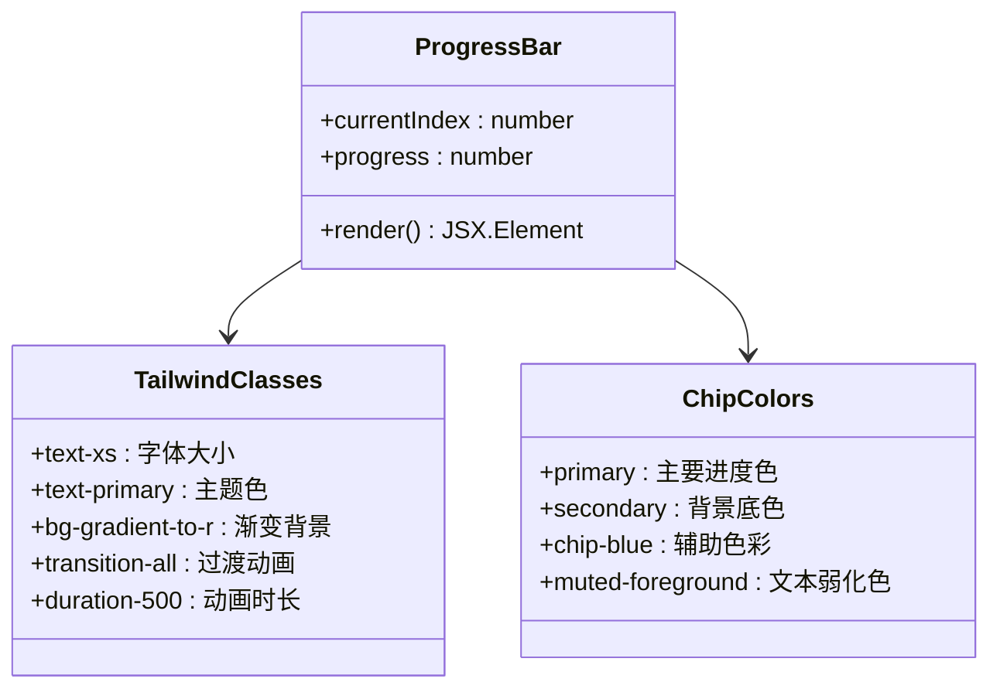

# 进度条组件

<cite>
**本文档引用的文件**
- [ProgressBar.tsx](file://src/components/ui/ProgressBar.tsx)
- [stepMetas.ts](file://src/data/stepMetas.ts)
- [ProcessDetailPage.tsx](file://src/components/layout/ProcessDetailPage.tsx)
- [index.css](file://src/index.css)
- [tailwind.config.ts](file://tailwind.config.ts)
- [ProcessNavigation.tsx](file://src/components/ui/ProcessNavigation.tsx)
- [HomePage.tsx](file://src/components/layout/HomePage.tsx)
</cite>

## 目录
1. [简介](#简介)
2. [项目结构](#项目结构)
3. [核心组件](#核心组件)
4. [架构概览](#架构概览)
5. [详细组件分析](#详细组件分析)
6. [依赖关系分析](#依赖关系分析)
7. [性能考虑](#性能考虑)
8. [故障排除指南](#故障排除指南)
9. [结论](#结论)
10. [附录](#附录)

## 简介

ProgressBar（进度条）组件是芯片制造演示应用中的核心可视化组件，用于展示用户在十项核心工艺步骤中的完成进度。该组件不仅提供数值化的进度指示，还通过渐变色彩、动画过渡和视觉反馈机制，为用户提供直观的导航体验。

该组件实现了完整的进度计算算法，支持动态进度更新，并通过CSS渐变和动画效果营造科技感十足的视觉体验。组件采用响应式设计，在不同屏幕尺寸下都能保持良好的可读性和交互性。

## 项目结构

进度条组件位于UI组件目录中，与数据模型和页面布局紧密集成：



**图表来源**
- [ProgressBar.tsx:1-60](file://src/components/ui/ProgressBar.tsx#L1-L60)
- [stepMetas.ts:1-103](file://src/data/stepMetas.ts#L1-L103)
- [ProcessDetailPage.tsx:1-397](file://src/components/layout/ProcessDetailPage.tsx#L1-L397)

**章节来源**
- [ProgressBar.tsx:1-60](file://src/components/ui/ProgressBar.tsx#L1-L60)
- [stepMetas.ts:1-103](file://src/data/stepMetas.ts#L1-L103)
- [ProcessDetailPage.tsx:1-397](file://src/components/layout/ProcessDetailPage.tsx#L1-L397)

## 核心组件

### 组件接口定义

ProgressBar组件采用简洁的接口设计，仅接收currentIndex参数：

```typescript
interface ProgressBarProps {
  currentIndex: number;
}
```

该设计确保了组件的高内聚性和低耦合性，便于在不同页面中复用。

### 进度计算算法

组件的核心逻辑基于以下公式：
```
progress = ((currentIndex + 1) / totalSteps) * 100
```

这个算法的特点：
- 使用currentIndex + 1确保进度从1%开始而非0%
- 除以总步骤数得到相对进度
- 乘以100转换为百分比格式

**章节来源**
- [ProgressBar.tsx:8-9](file://src/components/ui/ProgressBar.tsx#L8-L9)

## 架构概览

进度条组件在整个应用架构中的位置和作用：



**图表来源**
- [ProcessDetailPage.tsx:51-55](file://src/components/layout/ProcessDetailPage.tsx#L51-L55)
- [ProgressBar.tsx:8-9](file://src/components/ui/ProgressBar.tsx#L8-L9)

## 详细组件分析

### 视觉设计系统

#### 渐变色彩方案

组件采用多层次的渐变色彩设计：



**图表来源**
- [ProgressBar.tsx:21-26](file://src/components/ui/ProgressBar.tsx#L21-L26)
- [index.css:28-34](file://src/index.css#L28-L34)

#### 边框圆角设计

组件采用圆角矩形设计，提供柔和的视觉感受：

- 主进度条：`rounded-full` - 完全圆角设计
- 指示器卡片：`rounded-md` - 中等圆角
- 整体容器：`rounded-xl` - 大圆角边框

#### 动画过渡效果

组件实现了多层次的动画效果：



**图表来源**
- [ProgressBar.tsx:23-24](file://src/components/ui/ProgressBar.tsx#L23-L24)

### 状态管理系统

#### 当前进度值管理

组件通过props接收currentIndex，实现无状态设计：

```typescript
export function ProgressBar({ currentIndex }: ProgressBarProps) {
  const progress = ((currentIndex + 1) / processStepMetas.length) * 100;
  // ...
}
```

#### 总进度和完成状态

- **总进度**：由`processStepMetas.length`确定
- **完成状态**：通过currentIndex与length的关系判断
- **边界处理**：自动处理首尾步骤的特殊状态

#### 步骤指示器状态

组件包含三个状态层次：

1. **当前步骤**：高亮显示，使用`bg-primary/10`背景
2. **已完成步骤**：半透明状态，使用`hover:bg-secondary/60`
3. **待完成步骤**：灰度处理，使用`grayscale opacity-40`

**章节来源**
- [ProgressBar.tsx:28-56](file://src/components/ui/ProgressBar.tsx#L28-L56)

### 响应式适配

#### 移动端优化

组件针对移动端进行了专门优化：

- **字体大小**：使用`text-xs`和`text-sm`确保小屏幕可读性
- **间距调整**：`gap-1`和`mb-2.5`提供紧凑的布局
- **触摸目标**：指示器卡片提供足够的点击区域

#### 桌面端增强

在桌面端提供更丰富的视觉反馈：

- **图标尺寸**：使用`text-lg`和`text-2xl`增强视觉层次
- **阴影效果**：`shadow-glow`提供深度感
- **渐变背景**：`bg-gradient-card`营造科技氛围

### 动画过渡机制

#### 进度条动画

进度条使用CSS transition实现平滑的宽度变化：

```css
transition-all duration-500
```

动画特点：
- **持续时间**：500ms的自然过渡
- **缓动函数**：默认ease-in-out
- **触发条件**：进度百分比变化时自动触发

#### 交互动画

组件支持多种交互状态：

- **悬停效果**：`hover:bg-secondary/60`提供即时反馈
- **焦点状态**：`scale-110`放大当前步骤指示器
- **过渡动画**：所有状态变化都带有平滑过渡

**章节来源**
- [ProgressBar.tsx:23-24](file://src/components/ui/ProgressBar.tsx#L23-L24)
- [ProgressBar.tsx:33-39](file://src/components/ui/ProgressBar.tsx#L33-L39)

## 依赖关系分析

### 数据依赖



**图表来源**
- [ProgressBar.tsx:2](file://src/components/ui/ProgressBar.tsx#L2)
- [ProcessDetailPage.tsx:19](file://src/components/layout/ProcessDetailPage.tsx#L19)
- [stepMetas.ts:11-102](file://src/data/stepMetas.ts#L11-L102)

### 样式依赖

组件依赖于Tailwind CSS的原子化设计系统：



**图表来源**
- [ProgressBar.tsx:14-18](file://src/components/ui/ProgressBar.tsx#L14-L18)
- [ProgressBar.tsx:21-26](file://src/components/ui/ProgressBar.tsx#L21-L26)

**章节来源**
- [tailwind.config.ts:19-60](file://tailwind.config.ts#L19-L60)
- [index.css:5-51](file://src/index.css#L5-L51)

## 性能考虑

### 渲染优化

1. **无状态设计**：组件不维护内部状态，减少不必要的重渲染
2. **纯函数计算**：进度计算在渲染前完成，避免运行时计算开销
3. **最小DOM树**：组件结构简洁，DOM节点数量最少化

### 动画性能

- **硬件加速**：使用transform和opacity属性触发动画
- **合理时长**：500ms的动画时长平衡了流畅性和性能
- **缓动函数**：选择高效的CSS缓动函数

### 内存管理

- **事件监听**：组件不添加额外的事件监听器
- **样式复用**：大量使用预定义的Tailwind类，减少自定义样式的内存占用

## 故障排除指南

### 常见问题及解决方案

#### 进度显示异常

**问题**：进度百分比显示不正确
**原因**：currentIndex参数超出范围或数据加载延迟
**解决**：确保currentIndex在有效范围内，检查数据加载顺序

#### 样式不生效

**问题**：渐变效果或动画效果不显示
**原因**：Tailwind CSS配置问题或类名拼写错误
**解决**：检查tailwind.config.ts配置，确认类名正确

#### 响应式问题

**问题**：移动端显示效果不佳
**原因**：断点设置或媒体查询问题
**解决**：调整Tailwind的响应式断点配置

**章节来源**
- [ProgressBar.tsx:8-9](file://src/components/ui/ProgressBar.tsx#L8-L9)
- [tailwind.config.ts:14-17](file://tailwind.config.ts#L14-L17)

## 结论

ProgressBar组件通过简洁的设计理念和精心的实现细节，成功地将复杂的进度概念转化为直观的视觉体验。组件不仅实现了基本的进度显示功能，更重要的是通过渐变色彩、动画效果和响应式设计，为用户提供了沉浸式的交互体验。

该组件的设计体现了现代前端开发的最佳实践：
- **单一职责原则**：专注于进度显示，功能明确
- **可复用性**：通过props接口实现跨页面复用
- **性能优化**：无状态设计和高效动画实现
- **可访问性**：清晰的视觉层次和适当的对比度

## 附录

### 使用场景

1. **工艺流程导航**：在芯片制造演示中引导用户浏览各个工艺步骤
2. **学习进度跟踪**：帮助用户了解学习或探索的完成程度
3. **任务完成度显示**：在各种工作流程中显示任务完成状态

### 集成方式

组件可以通过简单的方式集成到任何页面中：

```typescript
<ProgressBar currentIndex={currentStepIndex} />
```

### 扩展建议

1. **自定义样式**：通过CSS变量支持主题定制
2. **动画配置**：增加动画时长和缓动函数的配置选项
3. **无障碍支持**：添加ARIA标签和键盘导航支持