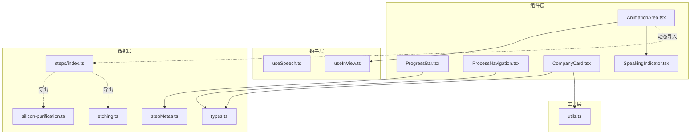
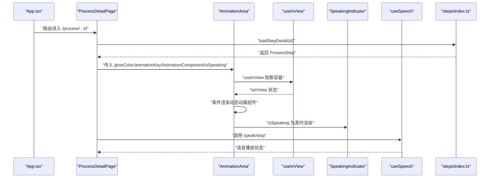
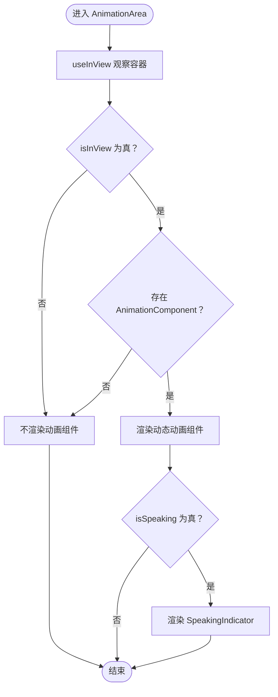
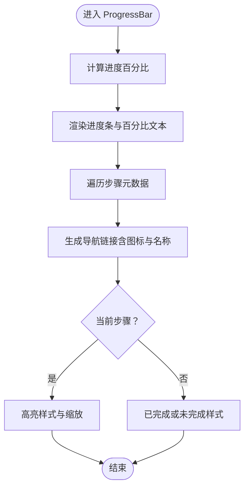
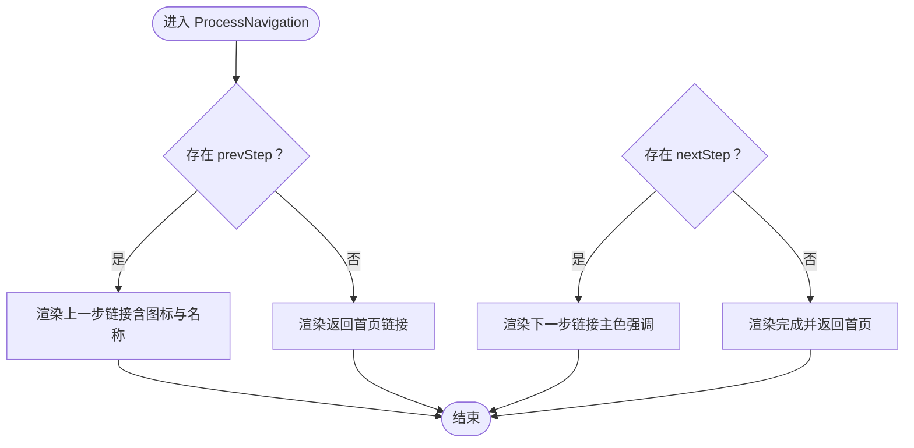
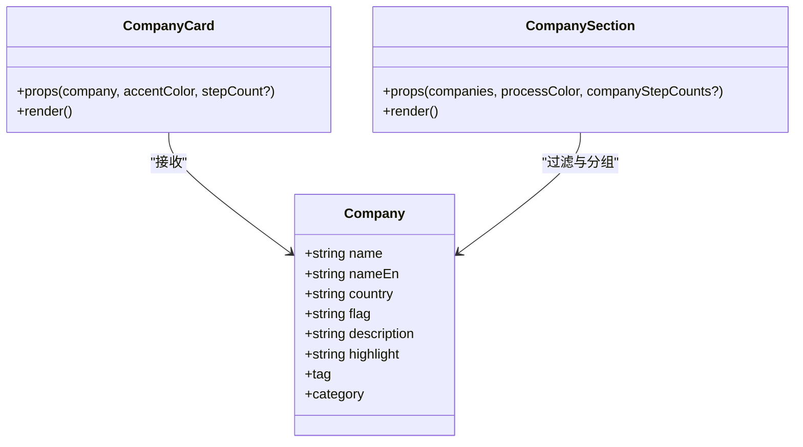
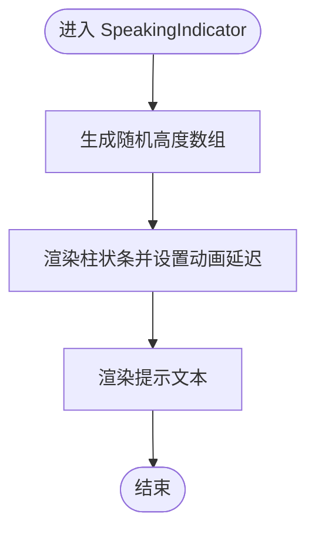
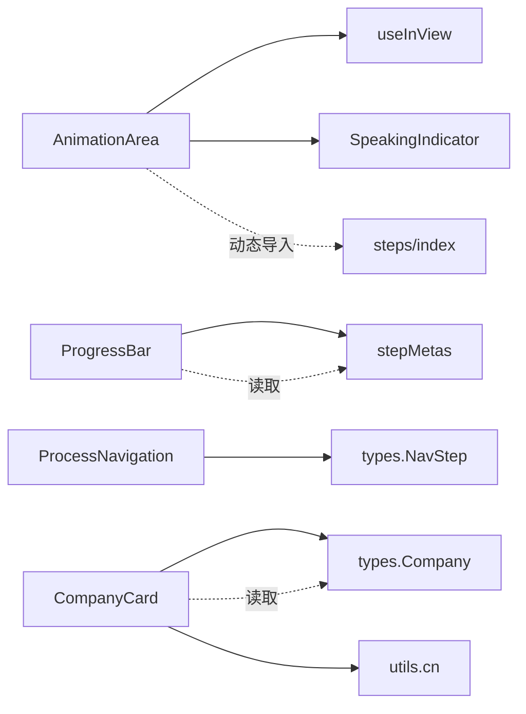

# 通用UI组件

<cite>
**本文引用的文件**
- [AnimationArea.tsx](file://src/components/ui/AnimationArea.tsx)
- [ProgressBar.tsx](file://src/components/ui/ProgressBar.tsx)
- [ProcessNavigation.tsx](file://src/components/ui/ProcessNavigation.tsx)
- [CompanyCard.tsx](file://src/components/ui/CompanyCard.tsx)
- [SpeakingIndicator.tsx](file://src/components/ui/SpeakingIndicator.tsx)
- [useSpeech.ts](file://src/hooks/useSpeech.ts)
- [useInView.ts](file://src/hooks/useInView.ts)
- [stepMetas.ts](file://src/data/stepMetas.ts)
- [types.ts](file://src/data/types.ts)
- [steps/index.ts](file://src/data/steps/index.ts)
- [silicon-purification.ts](file://src/data/steps/silicon-purification.ts)
- [etching.ts](file://src/data/steps/etching.ts)
- [utils.ts](file://src/lib/utils.ts)
- [App.tsx](file://src/App.tsx)
- [main.tsx](file://src/main.tsx)
</cite>

## 目录
1. [简介](#简介)
2. [项目结构](#项目结构)
3. [核心组件](#核心组件)
4. [架构总览](#架构总览)
5. [详细组件分析](#详细组件分析)
6. [依赖分析](#依赖分析)
7. [性能考虑](#性能考虑)
8. [故障排查指南](#故障排查指南)
9. [结论](#结论)
10. [附录](#附录)

## 简介
本文件面向通用UI组件的技术文档，围绕动画区域、进度条、工艺导航、公司卡片与语音指示器五大组件展开，系统阐述其设计模式、数据绑定、状态管理、动画与交互响应机制、可访问性支持以及性能优化策略。文档同时给出组件属性接口、事件处理与生命周期管理建议，并总结组件复用与样式定制方案。

## 项目结构
组件位于 src/components/ui 下，配合 hooks、data、lib 等模块协作，形成清晰的职责分层：
- 组件层：负责UI呈现与交互
- 钩子层：封装浏览器API与通用逻辑（如视口可见性、语音合成）
- 数据层：提供类型定义、步骤元数据与动态加载
- 工具层：提供样式合并工具

图表来源
- [AnimationArea.tsx:1-29](file://src/components/ui/AnimationArea.tsx#L1-L29)
- [ProgressBar.tsx:1-60](file://src/components/ui/ProgressBar.tsx#L1-L60)
- [ProcessNavigation.tsx:1-67](file://src/components/ui/ProcessNavigation.tsx#L1-L67)
- [CompanyCard.tsx:1-159](file://src/components/ui/CompanyCard.tsx#L1-L159)
- [SpeakingIndicator.tsx:1-28](file://src/components/ui/SpeakingIndicator.tsx#L1-L28)
- [useSpeech.ts:1-135](file://src/hooks/useSpeech.ts#L1-L135)
- [useInView.ts:1-32](file://src/hooks/useInView.ts#L1-L32)
- [stepMetas.ts:1-103](file://src/data/stepMetas.ts#L1-L103)
- [types.ts:1-33](file://src/data/types.ts#L1-L33)
- [steps/index.ts:1-34](file://src/data/steps/index.ts#L1-L34)
- [silicon-purification.ts:1-121](file://src/data/steps/silicon-purification.ts#L1-L121)
- [etching.ts:1-142](file://src/data/steps/etching.ts#L1-L142)
- [utils.ts:1-7](file://src/lib/utils.ts#L1-L7)

章节来源
- [App.tsx:1-23](file://src/App.tsx#L1-L23)
- [main.tsx:1-11](file://src/main.tsx#L1-L11)

## 核心组件
- 动画区域组件：基于视口可见性触发渲染，支持渐变背景与动态SVG动画组件挂载，内置语音指示器叠加显示。
- 进度条组件：展示当前步骤索引、完成百分比与步骤列表导航，使用渐变色与过渡动画提升视觉反馈。
- 工艺导航组件：提供上一步/下一步或返回首页的导航链接，根据是否存在后续步骤切换不同文案与样式。
- 公司卡片组件：展示企业信息、标签与高亮徽章，支持按标签分组与响应式网格布局。
- 语音指示器组件：随机高度柱状条配合脉冲动画，提示“语音讲解中”。

章节来源
- [AnimationArea.tsx:1-29](file://src/components/ui/AnimationArea.tsx#L1-L29)
- [ProgressBar.tsx:1-60](file://src/components/ui/ProgressBar.tsx#L1-L60)
- [ProcessNavigation.tsx:1-67](file://src/components/ui/ProcessNavigation.tsx#L1-L67)
- [CompanyCard.tsx:1-159](file://src/components/ui/CompanyCard.tsx#L1-L159)
- [SpeakingIndicator.tsx:1-28](file://src/components/ui/SpeakingIndicator.tsx#L1-L28)

## 架构总览
组件间通过props与数据层进行解耦协作，钩子层提供跨组件共享的通用能力（视口观察、语音合成）。路由由应用入口统一管理，页面通过动态导入加载具体步骤详情。

图表来源
- [App.tsx:1-23](file://src/App.tsx#L1-L23)
- [AnimationArea.tsx:1-29](file://src/components/ui/AnimationArea.tsx#L1-L29)
- [useInView.ts:1-32](file://src/hooks/useInView.ts#L1-L32)
- [SpeakingIndicator.tsx:1-28](file://src/components/ui/SpeakingIndicator.tsx#L1-L28)
- [useSpeech.ts:1-135](file://src/hooks/useSpeech.ts#L1-L135)
- [steps/index.ts:1-34](file://src/data/steps/index.ts#L1-L34)

## 详细组件分析

### 动画区域组件（AnimationArea）
- 职责与行为
  - 使用视口可见性钩子决定是否渲染动态动画组件，避免非可视区域的资源浪费。
  - 提供径向渐变背景，支持自定义发光色，营造聚焦与沉浸感。
  - 在语音讲解开启时叠加语音指示器，保证用户感知一致。
- 关键实现要点
  - props接口：glowColor、animationKey、AnimationComponent、isSpeaking。
  - 渲染策略：仅当 isInView 为真且存在动画组件时才挂载，减少不必要的重渲染。
  - 性能优化：通过 key 切换强制重新挂载动画组件，确保每次切换时动画重置。
- 可访问性与交互
  - 通过渐变与高光强调当前区域，提升视觉焦点。
  - 与语音指示器联动，避免视觉与听觉信息割裂。
- 复用与定制
  - 通过传入不同的 AnimationComponent 与 glowColor 实现主题化复用。
  - 建议在父组件中维护 isSpeaking 状态，以便与语音合成钩子协同。

图表来源
- [AnimationArea.tsx:1-29](file://src/components/ui/AnimationArea.tsx#L1-L29)
- [useInView.ts:1-32](file://src/hooks/useInView.ts#L1-L32)
- [SpeakingIndicator.tsx:1-28](file://src/components/ui/SpeakingIndicator.tsx#L1-L28)

章节来源
- [AnimationArea.tsx:1-29](file://src/components/ui/AnimationArea.tsx#L1-L29)
- [useInView.ts:1-32](file://src/hooks/useInView.ts#L1-L32)

### 进度条组件（ProgressBar）
- 职责与行为
  - 展示当前步骤索引、总步骤数与完成百分比。
  - 提供步骤列表的图标与名称导航，支持点击跳转至对应步骤详情。
  - 使用渐变色与过渡动画表现进度变化。
- 关键实现要点
  - props接口：currentIndex。
  - 计算进度：基于 currentIndex 与步骤总数计算百分比。
  - 步骤导航：遍历步骤元数据，生成带图标的导航项，当前步骤高亮，已完成步骤半透明，未完成步骤灰度。
- 可访问性与交互
  - 每个步骤项提供 title 与 hover 状态，便于键盘与鼠标操作。
  - 当前步骤项使用 scale 与字体加粗突出显示。
- 复用与定制
  - 通过 processStepMetas 的结构扩展步骤元数据即可无缝接入。
  - 建议在父组件中维护 currentIndex 并与路由状态保持同步。

图表来源
- [ProgressBar.tsx:1-60](file://src/components/ui/ProgressBar.tsx#L1-L60)
- [stepMetas.ts:1-103](file://src/data/stepMetas.ts#L1-L103)

章节来源
- [ProgressBar.tsx:1-60](file://src/components/ui/ProgressBar.tsx#L1-L60)
- [stepMetas.ts:1-103](file://src/data/stepMetas.ts#L1-L103)

### 工艺导航组件（ProcessNavigation）
- 职责与行为
  - 提供上一步与下一步的导航，若无上一步则返回首页，若无下一步则显示完成并返回首页。
  - 上一步使用浅色边框与悬停高亮，下一步使用主色调强调。
- 关键实现要点
  - props接口：prevStep（可空）、nextStep（可空）。
  - 条件渲染：根据是否存在 prevStep/nextStep 决定文案与样式。
  - 路由跳转：使用 react-router-dom 的 Link 组件跳转至对应步骤。
- 可访问性与交互
  - 提供明确的上下文文案（上一步/下一步/返回/完成）。
  - 悬停态提供颜色与边框变化，增强点击反馈。
- 复用与定制
  - 通过传入 prevStep/nextStep 的 id 与 name 即可适配任意流程。
  - 建议在父组件中根据当前步骤与流程边界计算 prevStep/nextStep。

图表来源
- [ProcessNavigation.tsx:1-67](file://src/components/ui/ProcessNavigation.tsx#L1-L67)

章节来源
- [ProcessNavigation.tsx:1-67](file://src/components/ui/ProcessNavigation.tsx#L1-L67)

### 公司卡片组件（CompanyCard）
- 职责与行为
  - 展示企业名称、英文名、国家旗帜、分类与高亮描述。
  - 支持按标签分组展示（国际龙头、中国力量、新兴势力），并提供响应式网格布局。
  - 支持可选的环节数量徽章与高光色背景。
- 关键实现要点
  - props接口：CompanyCard（包含企业信息与标签）、accentColor（强调色）、stepCount（可选）。
  - 标签映射：tagColorMap 与 tagGlowMap 将标签映射到颜色与阴影。
  - 分组展示：CompanySection 根据 tag 过滤并分组渲染。
  - 样式定制：通过 accentColor 动态设置高光色与边框，使用内联样式实现主题化。
- 可访问性与交互
  - 使用 role 与 aria-label 提升图片语义。
  - 描述文字支持悬停颜色过渡，增强可读性。
- 复用与定制
  - 通过传入不同的 accentColor 与 companyStepCounts 实现多流程复用。
  - 建议在父组件中维护颜色与计数映射，保证一致性。

图表来源
- [CompanyCard.tsx:1-159](file://src/components/ui/CompanyCard.tsx#L1-L159)
- [types.ts:1-33](file://src/data/types.ts#L1-L33)

章节来源
- [CompanyCard.tsx:1-159](file://src/components/ui/CompanyCard.tsx#L1-L159)
- [types.ts:1-33](file://src/data/types.ts#L1-L33)

### 语音指示器组件（SpeakingIndicator）
- 职责与行为
  - 渲染一组随机高度的柱状条，配合脉冲动画模拟音频可视化。
  - 显示“语音讲解中”提示文本，叠加在动画区域底部居中位置。
- 关键实现要点
  - 使用 useMemo 生成固定长度的随机高度数组，避免重复计算。
  - 通过 animation-delay 为每个柱设置错峰动画，增强节奏感。
  - 使用 backdrop-blur 与半透明背景提升可读性。
- 可访问性与交互
  - 文本与图标结合，明确传达当前状态。
  - 动画为辅助信息，不影响核心内容阅读。
- 复用与定制
  - 可在任意容器中复用，只需传入 isSpeaking 控制显示。
  - 建议与 useSpeech 钩子的状态联动，确保显示与实际语音状态一致。

图表来源
- [SpeakingIndicator.tsx:1-28](file://src/components/ui/SpeakingIndicator.tsx#L1-L28)

章节来源
- [SpeakingIndicator.tsx:1-28](file://src/components/ui/SpeakingIndicator.tsx#L1-L28)

## 依赖分析
- 组件依赖关系
  - AnimationArea 依赖 useInView 与 SpeakingIndicator。
  - ProgressBar 依赖 stepMetas。
  - ProcessNavigation 依赖 types 中的 NavStep 结构。
  - CompanyCard 依赖 types 中的 Company 结构与 utils 的样式合并工具。
  - SpeakingIndicator 为独立展示组件，被 AnimationArea 复用。
- 数据依赖关系
  - steps/index.ts 提供动态导入，按需加载具体步骤详情。
  - stepMetas.ts 提供步骤元数据，驱动进度条与导航。
- 钩子依赖关系
  - useSpeech 提供语音合成能力，与 AnimationArea 的 isSpeaking 状态协同。
  - useInView 提供视口可见性观察，驱动动画组件的懒加载与重渲染。

图表来源
- [AnimationArea.tsx:1-29](file://src/components/ui/AnimationArea.tsx#L1-L29)
- [ProgressBar.tsx:1-60](file://src/components/ui/ProgressBar.tsx#L1-L60)
- [ProcessNavigation.tsx:1-67](file://src/components/ui/ProcessNavigation.tsx#L1-L67)
- [CompanyCard.tsx:1-159](file://src/components/ui/CompanyCard.tsx#L1-L159)
- [SpeakingIndicator.tsx:1-28](file://src/components/ui/SpeakingIndicator.tsx#L1-L28)
- [useSpeech.ts:1-135](file://src/hooks/useSpeech.ts#L1-L135)
- [useInView.ts:1-32](file://src/hooks/useInView.ts#L1-L32)
- [stepMetas.ts:1-103](file://src/data/stepMetas.ts#L1-L103)
- [types.ts:1-33](file://src/data/types.ts#L1-L33)
- [steps/index.ts:1-34](file://src/data/steps/index.ts#L1-L34)
- [utils.ts:1-7](file://src/lib/utils.ts#L1-L7)

章节来源
- [steps/index.ts:1-34](file://src/data/steps/index.ts#L1-L34)
- [stepMetas.ts:1-103](file://src/data/stepMetas.ts#L1-L103)
- [types.ts:1-33](file://src/data/types.ts#L1-L33)
- [utils.ts:1-7](file://src/lib/utils.ts#L1-L7)

## 性能考虑
- 懒加载与按需渲染
  - AnimationArea 仅在 isInView 为真时渲染动态动画组件，减少非可视区域的开销。
  - steps/index.ts 通过动态导入按需加载步骤详情，降低首屏体积。
- 动画与过渡
  - ProgressBar 使用过渡动画更新宽度，useSpeech 的 rate/pitch/volume 参数平衡清晰度与自然度。
  - SpeakingIndicator 使用固定数量的柱与错峰动画，避免过度计算。
- 样式与主题
  - CompanyCard 通过内联样式与主题色变量实现快速主题切换，避免额外CSS类冲突。
  - utils.cn 合并类名，减少无效样式组合。
- 可见性与重渲染
  - useInView 默认阈值为 0.1，兼顾性能与体验；可根据场景调整 rootMargin 与阈值。
- 语音合成
  - useSpeech 缓存最佳中文语音并持久化偏好，避免重复评分与查找；在 voices 未就绪时等待 onvoiceschanged 事件，确保稳定性。

## 故障排查指南
- 语音无法播放
  - 确认浏览器支持 Web Speech API；检查 isSpeaking 状态与 useSpeech 的 speak/stop 调用链路。
  - 若首次调用无声音，等待 onvoiceschanged 事件后重试。
- 动画不出现
  - 检查 AnimationArea 的 isInView 状态，确认容器是否在视口内或阈值设置是否合适。
  - 确认 animationKey 是否随步骤切换而变化，以触发组件重挂载。
- 进度条不更新
  - 确认 currentIndex 与步骤总数一致，检查 processStepMetas 的顺序与长度。
  - 确保路由跳转时 currentIndex 与 URL 参数同步。
- 导航按钮异常
  - 检查 prevStep/nextStep 的 id 与 name 是否正确传入，确认 Link 的 to 路径有效。
- 样式错乱
  - 确认 accentColor 与 tag 对应的颜色映射表一致，避免主题色不匹配。
  - 使用 utils.cn 合并类名，避免 Tailwind 类冲突导致样式丢失。

章节来源
- [useSpeech.ts:1-135](file://src/hooks/useSpeech.ts#L1-L135)
- [useInView.ts:1-32](file://src/hooks/useInView.ts#L1-L32)
- [ProgressBar.tsx:1-60](file://src/components/ui/ProgressBar.tsx#L1-L60)
- [ProcessNavigation.tsx:1-67](file://src/components/ui/ProcessNavigation.tsx#L1-L67)
- [CompanyCard.tsx:1-159](file://src/components/ui/CompanyCard.tsx#L1-L159)
- [utils.ts:1-7](file://src/lib/utils.ts#L1-L7)

## 结论
本项目通过清晰的组件分层与钩子抽象，实现了动画区域、进度条、工艺导航、公司卡片与语音指示器的高内聚、低耦合设计。组件具备良好的可复用性与可定制性，结合动态导入与视口观察等性能策略，能够在复杂流程场景中提供流畅的用户体验。建议在实际工程中进一步完善状态管理与错误边界，以提升系统的健壮性与可维护性。

## 附录
- 组件属性接口与事件处理建议
  - AnimationArea
    - 属性：glowColor（字符串）、animationKey（数字）、AnimationComponent（函数组件或null）、isSpeaking（布尔）
    - 事件：无直接事件，通过 isSpeaking 与父组件状态联动
  - ProgressBar
    - 属性：currentIndex（数字）
    - 事件：点击步骤项触发路由跳转（由 Link 组件处理）
  - ProcessNavigation
    - 属性：prevStep（可空，包含 id/name）、nextStep（可空，包含 id/name）
    - 事件：点击上一步/下一步触发路由跳转
  - CompanyCard
    - 属性：company（Company）、accentColor（字符串）、stepCount（可空数字）
    - 事件：无直接事件，依赖父组件的点击与路由
  - SpeakingIndicator
    - 属性：无（内部状态由组件自身管理）
    - 事件：无直接事件，作为动画指示器使用
- 生命周期管理建议
  - AnimationArea：在父组件中维护 isSpeaking 与 animationKey，随步骤切换更新；在卸载时确保取消语音与观察器清理。
  - ProgressBar：在路由监听中同步 currentIndex，避免与历史记录冲突。
  - ProcessNavigation：在步骤变更时重新计算 prevStep/nextStep。
  - CompanyCard：在数据加载完成后渲染，避免空数据导致的样式抖动。
  - SpeakingIndicator：与 useSpeech 的 stop 配合，在离开页面或切换步骤时停止播放。