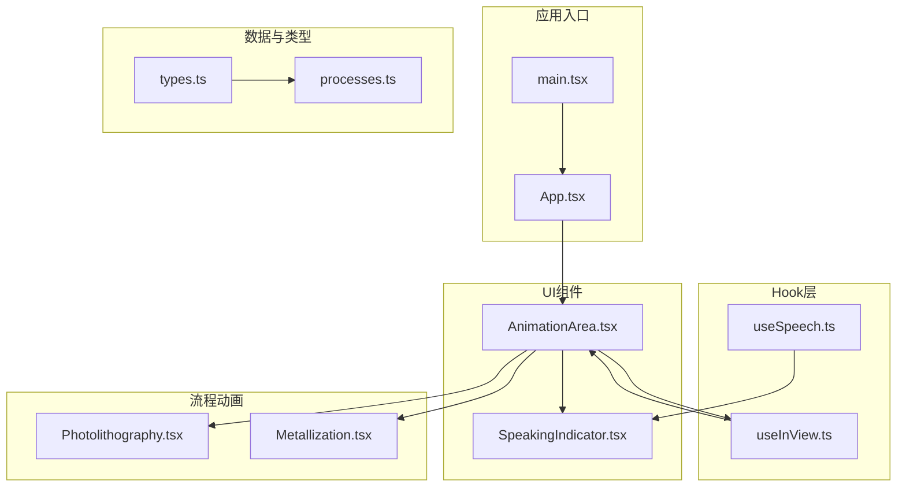
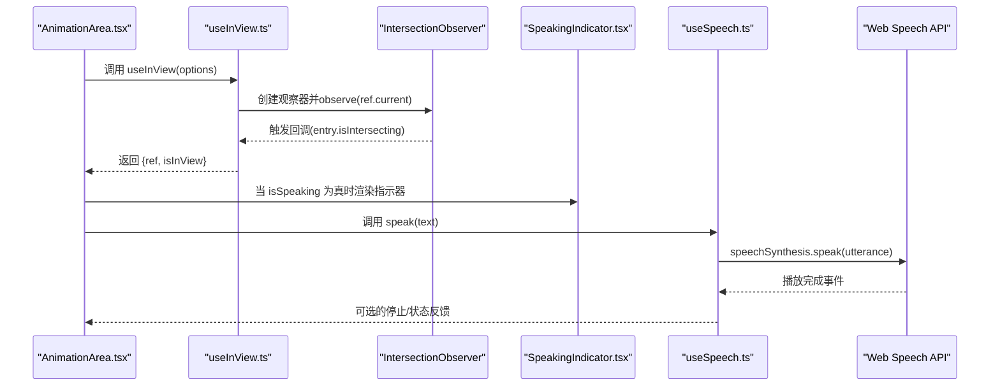
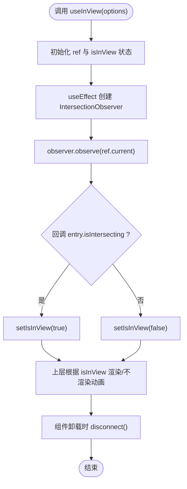
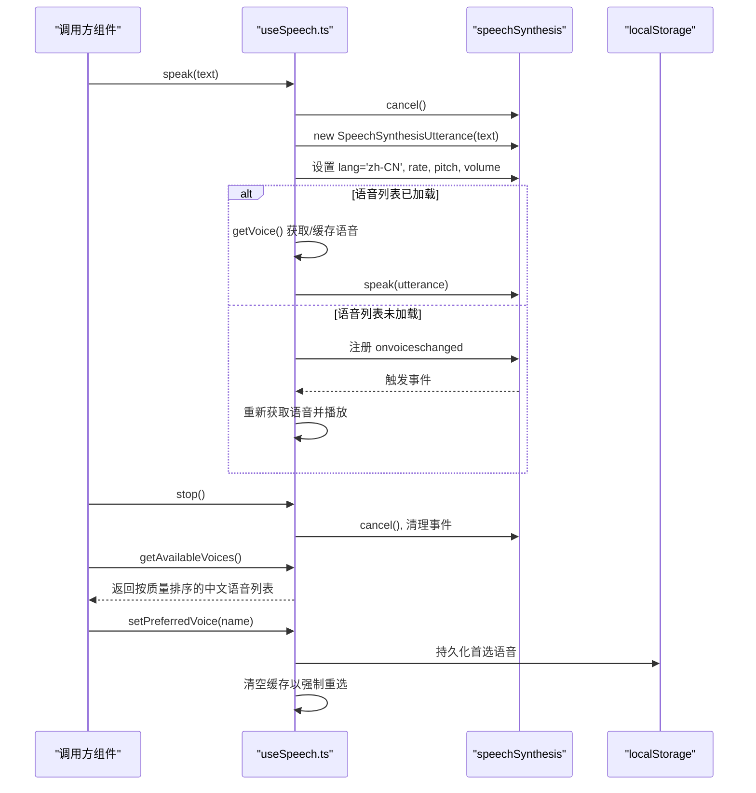
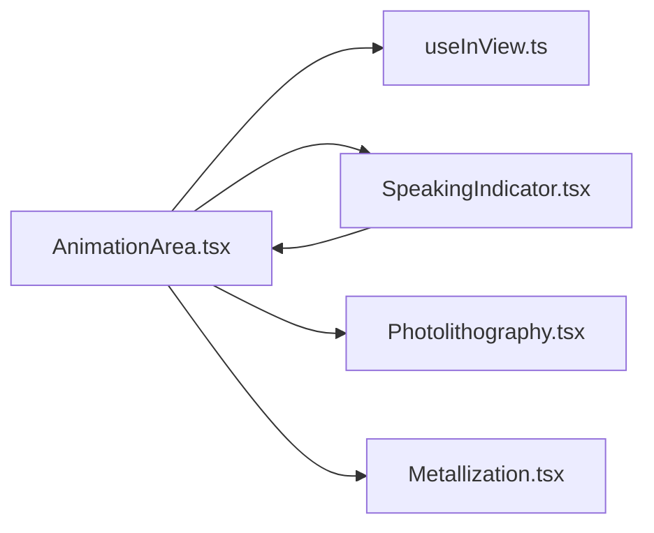
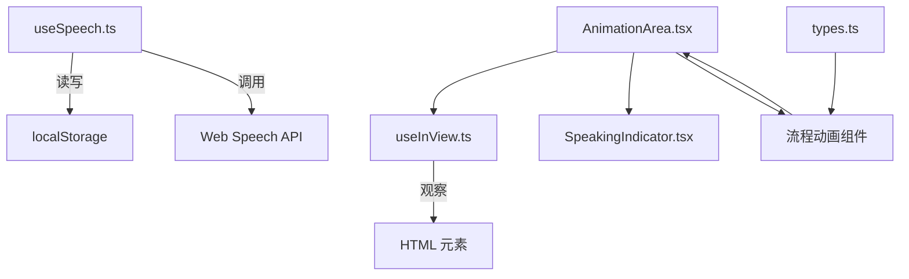

# 自定义Hook

<cite>
**本文引用的文件**
- [useInView.ts](file://src/hooks/useInView.ts)
- [useSpeech.ts](file://src/hooks/useSpeech.ts)
- [AnimationArea.tsx](file://src/components/ui/AnimationArea.tsx)
- [SpeakingIndicator.tsx](file://src/components/ui/SpeakingIndicator.tsx)
- [Photolithography.tsx](file://src/components/process/Photolithography.tsx)
- [Metallization.tsx](file://src/components/process/Metallization.tsx)
- [utils.ts](file://src/lib/utils.ts)
- [App.tsx](file://src/App.tsx)
- [main.tsx](file://src/main.tsx)
- [processes.ts](file://src/data/processes.ts)
- [types.ts](file://src/data/types.ts)
</cite>

## 目录
1. [简介](#简介)
2. [项目结构](#项目结构)
3. [核心组件](#核心组件)
4. [架构总览](#架构总览)
5. [详细组件分析](#详细组件分析)
6. [依赖关系分析](#依赖关系分析)
7. [性能考量](#性能考量)
8. [故障排查指南](#故障排查指南)
9. [结论](#结论)
10. [附录：开发指导与最佳实践](#附录开发指导与最佳实践)

## 简介
本项目提供了两个关键的自定义Hook：
- useInView：基于 Intersection Observer API 的视口可见性检测与懒加载控制，用于在元素进入视口时才渲染昂贵的动画组件，提升首屏性能与用户体验。
- useSpeech：封装 Web Speech API 的中文语音合成能力，自动选择高质量中文语音、缓存用户偏好，并提供统一的播放/停止接口，同时支持无障碍访问提示。

这两个Hook分别服务于“性能优化”和“可访问性增强”的目标，通过解耦逻辑与UI，实现跨组件的高复用与一致体验。

## 项目结构
与Hook直接相关的核心目录与文件如下：
- hooks：存放自定义Hook（useInView、useSpeech）
- components/ui：通用UI组件（AnimationArea、SpeakingIndicator）
- components/process：具体工艺流程的可视化组件（如 Photolithography、Metallization）
- data：类型定义与数据加载入口（types、processes）
- lib：工具函数（cn）
- 应用入口：App.tsx、main.tsx

图表来源
- [main.tsx:1-11](file://src/main.tsx#L1-L11)
- [App.tsx:1-23](file://src/App.tsx#L1-L23)
- [AnimationArea.tsx:1-29](file://src/components/ui/AnimationArea.tsx#L1-L29)
- [useInView.ts:1-32](file://src/hooks/useInView.ts#L1-L32)
- [useSpeech.ts:1-135](file://src/hooks/useSpeech.ts#L1-L135)
- [SpeakingIndicator.tsx:1-28](file://src/components/ui/SpeakingIndicator.tsx#L1-L28)
- [Photolithography.tsx:1-136](file://src/components/process/Photolithography.tsx#L1-L136)
- [Metallization.tsx:1-120](file://src/components/process/Metallization.tsx#L1-L120)
- [types.ts:1-33](file://src/data/types.ts#L1-L33)
- [processes.ts:1-3](file://src/data/processes.ts#L1-L3)

章节来源
- [main.tsx:1-11](file://src/main.tsx#L1-L11)
- [App.tsx:1-23](file://src/App.tsx#L1-L23)
- [AnimationArea.tsx:1-29](file://src/components/ui/AnimationArea.tsx#L1-L29)
- [useInView.ts:1-32](file://src/hooks/useInView.ts#L1-L32)
- [useSpeech.ts:1-135](file://src/hooks/useSpeech.ts#L1-L135)
- [SpeakingIndicator.tsx:1-28](file://src/components/ui/SpeakingIndicator.tsx#L1-L28)
- [Photolithography.tsx:1-136](file://src/components/process/Photolithography.tsx#L1-L136)
- [Metallization.tsx:1-120](file://src/components/process/Metallization.tsx#L1-L120)
- [types.ts:1-33](file://src/data/types.ts#L1-L33)
- [processes.ts:1-3](file://src/data/processes.ts#L1-L3)

## 核心组件
- useInView：返回 ref 与 isInView 状态，结合 Intersection Observer 实现懒加载与节流渲染；支持阈值与根边距配置。
- useSpeech：提供 speak、stop、getAvailableVoices、setPreferredVoice 四个方法；内部处理语音加载延迟、偏好记忆、质量评分与本地存储持久化。

章节来源
- [useInView.ts:1-32](file://src/hooks/useInView.ts#L1-L32)
- [useSpeech.ts:1-135](file://src/hooks/useSpeech.ts#L1-L135)

## 架构总览
下图展示了Hook与组件之间的交互关系及数据流向。

图表来源
- [AnimationArea.tsx:1-29](file://src/components/ui/AnimationArea.tsx#L1-L29)
- [useInView.ts:1-32](file://src/hooks/useInView.ts#L1-L32)
- [SpeakingIndicator.tsx:1-28](file://src/components/ui/SpeakingIndicator.tsx#L1-L28)
- [useSpeech.ts:1-135](file://src/hooks/useSpeech.ts#L1-L135)

## 详细组件分析

### useInView Hook 分析
- 设计模式与复用策略
  - 基于 Hook 的状态与副作用封装，将 DOM 观察逻辑与组件渲染解耦，便于在多个组件中复用。
  - 通过 ref 暴露被观察元素，返回 isInView 控制是否渲染昂贵内容，实现“懒加载”。
- 参数配置
  - threshold：交叉比例阈值，默认 0.1，越小越容易触发。
  - rootMargin：根边距，默认 '0px'，可提前或延后触发。
- 返回值结构
  - ref：指向被观察的 HTML 元素。
  - isInView：布尔值，表示元素是否进入视口。
- 生命周期管理
  - 在 useEffect 中创建 IntersectionObserver 并 observe，组件卸载时 disconnect，避免内存泄漏。
- 使用场景
  - 在长列表或复杂SVG动画区域仅在可见时渲染，减少初始渲染压力。
- 性能影响
  - 降低不必要的昂贵计算与DOM节点创建，改善滚动流畅度。

图表来源
- [useInView.ts:15-28](file://src/hooks/useInView.ts#L15-L28)

章节来源
- [useInView.ts:1-32](file://src/hooks/useInView.ts#L1-L32)

### useSpeech Hook 分析
- 设计模式与复用策略
  - 将语音选择、评分、缓存与播放逻辑集中在一个Hook中，供任何需要语音讲解的组件调用。
  - 提供 getAvailableVoices 与 setPreferredVoice，便于构建语音偏好设置界面。
- 语音选择与无障碍支持
  - 内置中文语音质量评分函数，优先神经音色、本地服务、zh-CN 语言等，提升自然度与可靠性。
  - 通过 localStorage 记忆用户偏好的语音名称，下次自动恢复。
  - speak 前会取消正在进行的播报，避免并发冲突；stop 支持主动中断。
- API 与返回值
  - speak(text)：播放指定文本（zh-CN）。
  - stop()：立即停止播放并清理事件监听。
  - getAvailableVoices()：返回按质量排序的可用中文语音列表。
  - setPreferredVoice(name)：手动设置首选语音并持久化。
- 与组件的集成
  - AnimationArea 接收 isSpeaking 状态，配合 SpeakingIndicator 展示“语音讲解中”的视觉反馈。
  - 语音文本通常来自流程步骤的 narration 字段（见数据类型）。

图表来源
- [useSpeech.ts:74-112](file://src/hooks/useSpeech.ts#L74-L112)
- [useSpeech.ts:118-131](file://src/hooks/useSpeech.ts#L118-L131)

章节来源
- [useSpeech.ts:1-135](file://src/hooks/useSpeech.ts#L1-L135)
- [AnimationArea.tsx:1-29](file://src/components/ui/AnimationArea.tsx#L1-L29)
- [SpeakingIndicator.tsx:1-28](file://src/components/ui/SpeakingIndicator.tsx#L1-L28)
- [types.ts:19-32](file://src/data/types.ts#L19-L32)

### 组件集成与使用场景
- AnimationArea
  - 通过 useInView 控制动画组件的懒加载，仅当区域进入视口时渲染对应动画（如 Photolithography、Metallization）。
  - 结合 isSpeaking 渲染 SpeakingIndicator，提供可视化的语音状态反馈。
- SpeakingIndicator
  - 渲染一组随机高度的脉冲条形，模拟“语音中”的视觉效果，配合无障碍文案。
- 流程动画组件
  - 如 Photolithography、Metallization 等，作为 AnimationArea 的子组件，负责具体的SVG动画与视觉呈现。

图表来源
- [AnimationArea.tsx:11-28](file://src/components/ui/AnimationArea.tsx#L11-L28)
- [useInView.ts:8-31](file://src/hooks/useInView.ts#L8-L31)
- [SpeakingIndicator.tsx:3-27](file://src/components/ui/SpeakingIndicator.tsx#L3-L27)
- [Photolithography.tsx:1-136](file://src/components/process/Photolithography.tsx#L1-L136)
- [Metallization.tsx:1-120](file://src/components/process/Metallization.tsx#L1-L120)

章节来源
- [AnimationArea.tsx:1-29](file://src/components/ui/AnimationArea.tsx#L1-L29)
- [SpeakingIndicator.tsx:1-28](file://src/components/ui/SpeakingIndicator.tsx#L1-L28)
- [Photolithography.tsx:1-136](file://src/components/process/Photolithography.tsx#L1-L136)
- [Metallization.tsx:1-120](file://src/components/process/Metallization.tsx#L1-L120)

## 依赖关系分析
- useInView 依赖浏览器原生 IntersectionObserver，无外部依赖。
- useSpeech 依赖 Web Speech API 与 localStorage，内部处理异步语音列表加载与偏好持久化。
- AnimationArea 依赖 useInView 与 SpeakingIndicator，同时消费流程动画组件。
- 数据类型与加载入口位于 data 目录，为流程页面提供结构化数据支撑。

图表来源
- [useInView.ts:19-27](file://src/hooks/useInView.ts#L19-L27)
- [useSpeech.ts:42-62](file://src/hooks/useSpeech.ts#L42-L62)
- [useSpeech.ts:95-104](file://src/hooks/useSpeech.ts#L95-L104)
- [AnimationArea.tsx:12-22](file://src/components/ui/AnimationArea.tsx#L12-L22)
- [types.ts:19-32](file://src/data/types.ts#L19-L32)

章节来源
- [useInView.ts:1-32](file://src/hooks/useInView.ts#L1-L32)
- [useSpeech.ts:1-135](file://src/hooks/useSpeech.ts#L1-L135)
- [AnimationArea.tsx:1-29](file://src/components/ui/AnimationArea.tsx#L1-L29)
- [types.ts:1-33](file://src/data/types.ts#L1-L33)

## 性能考量
- useInView
  - 通过阈值与根边距微调触发时机，避免过早/过晚渲染造成抖动或浪费。
  - 卸载时断开观察器，防止内存泄漏与后台持续计算。
- useSpeech
  - 首次调用若语音列表未就绪，等待 onvoiceschanged 后再播放，避免失败重试。
  - 缓存首选语音到内存与 localStorage，减少重复扫描与网络依赖。
  - 播放前取消当前任务，避免多段语音叠加。
- 组件层面
  - AnimationArea 仅在 isInView 为真时渲染动画组件，显著降低初始渲染成本。
  - SpeakingIndicator 使用 useMemo 生成固定高度序列，避免每次渲染都重新计算。

章节来源
- [useInView.ts:15-28](file://src/hooks/useInView.ts#L15-L28)
- [useSpeech.ts:74-112](file://src/hooks/useSpeech.ts#L74-L112)
- [useSpeech.ts:118-131](file://src/hooks/useSpeech.ts#L118-L131)
- [AnimationArea.tsx:12-22](file://src/components/ui/AnimationArea.tsx#L12-L22)
- [SpeakingIndicator.tsx:4-7](file://src/components/ui/SpeakingIndicator.tsx#L4-L7)

## 故障排查指南
- 语音无法播放
  - 确认浏览器支持 Web Speech API；若不支持，Hook 会在控制台输出警告并返回。
  - 确认系统语言设置为中文（zh-CN），否则可能选择不到合适的语音。
  - 若首次调用即无语音列表，等待 onvoiceschanged 事件后再尝试。
- 语音质量不佳
  - 使用 getAvailableVoices 查看可用中文语音列表，必要时通过 setPreferredVoice 手动切换。
  - 偏好会持久化到 localStorage，重启后仍可恢复。
- 动画不出现
  - 检查 useInView 的阈值与根边距设置是否过于严格，导致元素长时间不进入视口。
  - 确保传入的 ref 正确绑定到真实DOM元素。
- 停止无效
  - 调用 stop() 后需确保没有新的 speak() 在短时间内再次触发。

章节来源
- [useSpeech.ts:76-79](file://src/hooks/useSpeech.ts#L76-L79)
- [useSpeech.ts:95-104](file://src/hooks/useSpeech.ts#L95-L104)
- [useSpeech.ts:109-112](file://src/hooks/useSpeech.ts#L109-L112)
- [useInView.ts:15-28](file://src/hooks/useInView.ts#L15-L28)

## 结论
本项目通过 useInView 与 useSpeech 两个自定义Hook，实现了“性能优先”的懒加载与“可访问友好”的语音讲解。它们以最小的侵入性与最高的复用性，将复杂的平台差异与状态管理抽象出来，使上层组件能够专注于业务逻辑与交互设计。建议在新功能开发中遵循本文档的模式与最佳实践，确保一致性与可维护性。

## 附录：开发指导与最佳实践
- 设计模式
  - 将平台API（如 IntersectionObserver、Web Speech API）封装为Hook，暴露稳定、简洁的接口。
  - 使用 useRef 缓存昂贵对象（如语音实例），避免重复创建。
  - 在 useEffect 中注册/清理副作用，确保组件卸载时释放资源。
- 参数与返回值
  - useInView：options 包含 threshold 与 rootMargin；返回 ref 与 isInView。
  - useSpeech：返回 speak、stop、getAvailableVoices、setPreferredVoice；内部处理偏好持久化与质量评分。
- 使用场景
  - 在长列表、复杂动画、高分辨率图像等场景中优先采用懒加载策略。
  - 对面向中文用户的讲解类内容，优先选择本地服务、神经音色与 zh-CN 语言。
- 性能与内存
  - 避免在高频渲染路径中进行昂贵操作；将计算移至 useCallback/useMemo。
  - 及时断开观察器与清理事件监听，防止内存泄漏。
- 无障碍与可访问性
  - 为语音状态提供可视反馈（如 SpeakingIndicator），并保持文案简洁明确。
  - 为语音功能提供可关闭/可切换的入口，尊重用户偏好。
- 开发建议
  - 为Hook编写清晰的注释与类型定义，便于团队协作。
  - 在组件中通过 props 明确传递 isSpeaking、animationKey 等关键状态，保证Hook与UI解耦。
  - 对外暴露的Hook尽量只做“状态与副作用”，不直接渲染UI，保持职责单一。