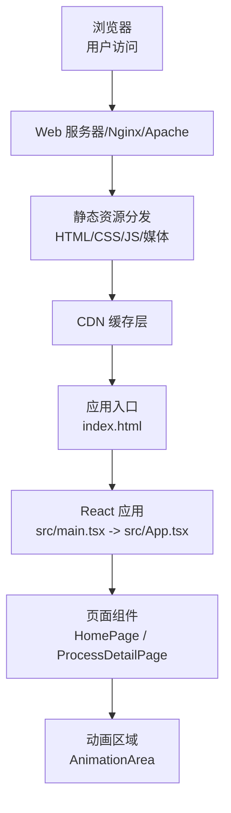
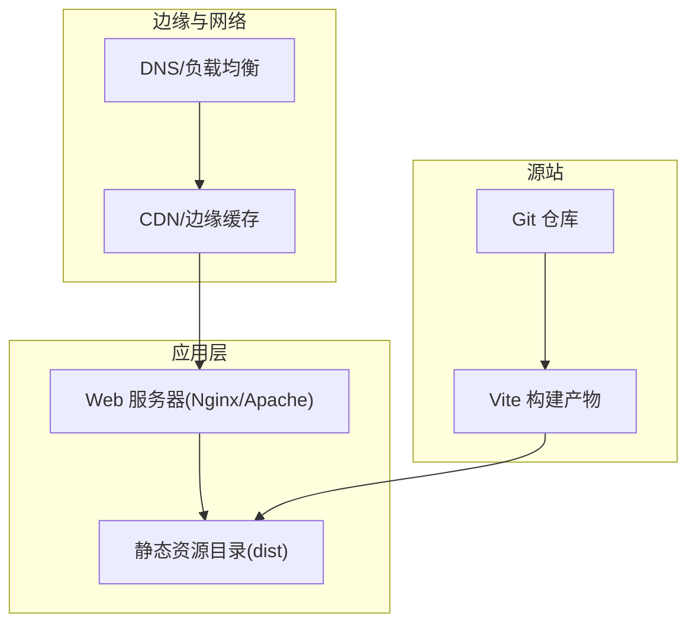
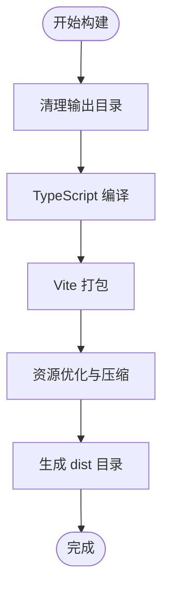
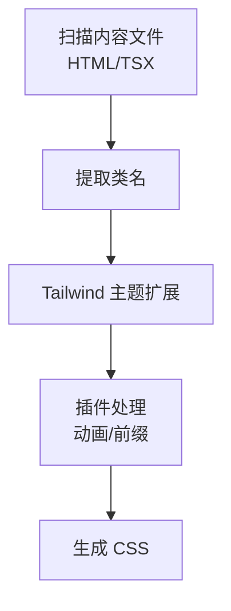
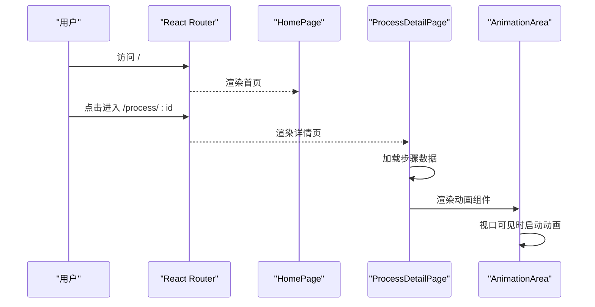
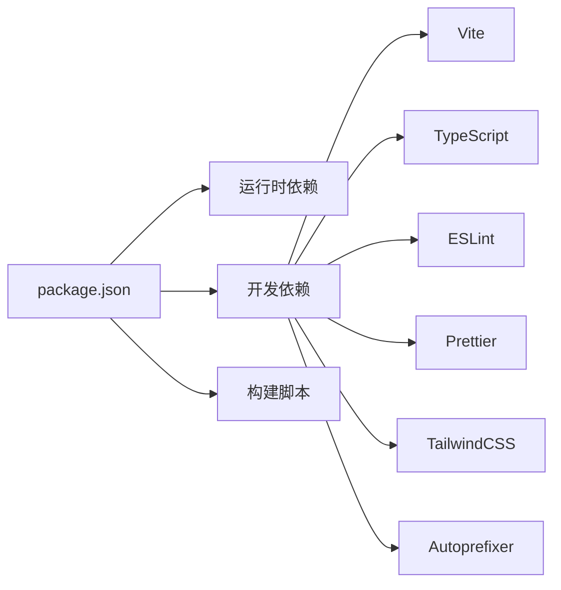

# 部署指南

<cite>
**本文引用的文件**
- [package.json](file://package.json)
- [vite.config.ts](file://vite.config.ts)
- [tailwind.config.ts](file://tailwind.config.ts)
- [postcss.config.js](file://postcss.config.js)
- [index.html](file://index.html)
- [tsconfig.json](file://tsconfig.json)
- [tsconfig.app.json](file://tsconfig.app.json)
- [eslint.config.mjs](file://eslint.config.mjs)
- [.prettierrc](file://.prettierrc)
- [.npmrc](file://.npmrc)
- [src/main.tsx](file://src/main.tsx)
- [src/App.tsx](file://src/App.tsx)
- [src/components/layout/HomePage.tsx](file://src/components/layout/HomePage.tsx)
- [src/components/layout/ProcessDetailPage.tsx](file://src/components/layout/ProcessDetailPage.tsx)
- [src/components/ui/AnimationArea.tsx](file://src/components/ui/AnimationArea.tsx)
</cite>

## 目录
1. [简介](#简介)
2. [项目结构](#项目结构)
3. [核心组件](#核心组件)
4. [架构总览](#架构总览)
5. [详细组件分析](#详细组件分析)
6. [依赖分析](#依赖分析)
7. [性能考虑](#性能考虑)
8. [故障排除指南](#故障排除指南)
9. [结论](#结论)
10. [附录](#附录)

## 简介
本指南面向运维与开发团队，提供“芯片制造演示”项目的生产环境构建、配置与优化策略，覆盖静态资源处理、CDN 集成、服务器配置、性能监控、多平台部署（GitHub Pages、Vercel、Netlify）、环境变量与配置文件安全处理、部署后验证与回滚策略、缓存与资源压缩配置，以及部署检查清单与故障排除建议。

## 项目结构
该项目基于 Vite + React + TypeScript 构建，使用 TailwindCSS 作为样式框架，并通过 PostCSS 自动前缀与按需扫描内容以生成最小化 CSS。前端为单页应用（SPA），路由由 React Router DOM 提供。

图表来源
- [index.html:1-15](file://index.html#L1-L15)
- [src/main.tsx:1-11](file://src/main.tsx#L1-L11)
- [src/App.tsx:1-23](file://src/App.tsx#L1-L23)
- [src/components/layout/HomePage.tsx:1-85](file://src/components/layout/HomePage.tsx#L1-L85)
- [src/components/layout/ProcessDetailPage.tsx:1-397](file://src/components/layout/ProcessDetailPage.tsx#L1-L397)
- [src/components/ui/AnimationArea.tsx:1-29](file://src/components/ui/AnimationArea.tsx#L1-L29)

章节来源
- [package.json:1-45](file://package.json#L1-L45)
- [vite.config.ts:1-13](file://vite.config.ts#L1-L13)
- [tailwind.config.ts:1-143](file://tailwind.config.ts#L1-L143)
- [postcss.config.js:1-7](file://postcss.config.js#L1-L7)
- [index.html:1-15](file://index.html#L1-L15)
- [tsconfig.json:1-7](file://tsconfig.json#L1-L7)
- [tsconfig.app.json:1-26](file://tsconfig.app.json#L1-L26)

## 核心组件
- 构建工具链：Vite 提供开发服务器与生产打包；TypeScript 进行类型检查与编译；ESLint + Prettier 保障代码质量与风格一致。
- 样式体系：TailwindCSS 按需扫描内容，PostCSS 自动添加厂商前缀；通过主题扩展与动画定义实现丰富的视觉效果。
- 前端框架：React + React Router DOM 实现 SPA 路由与页面切换；页面组件负责数据加载、动画渲染与交互控制。
- 入口与模板：index.html 作为应用根模板，引入全局样式与应用入口脚本；src/main.tsx 创建根节点并挂载 App。

章节来源
- [package.json:1-45](file://package.json#L1-L45)
- [vite.config.ts:1-13](file://vite.config.ts#L1-L13)
- [tailwind.config.ts:1-143](file://tailwind.config.ts#L1-L143)
- [postcss.config.js:1-7](file://postcss.config.js#L1-L7)
- [index.html:1-15](file://index.html#L1-L15)
- [tsconfig.json:1-7](file://tsconfig.json#L1-L7)
- [tsconfig.app.json:1-26](file://tsconfig.app.json#L1-L26)
- [src/main.tsx:1-11](file://src/main.tsx#L1-L11)
- [src/App.tsx:1-23](file://src/App.tsx#L1-L23)

## 架构总览
下图展示生产环境部署的典型拓扑：CDN 作为边缘缓存，Web 服务器提供静态资源服务，应用通过 SPA 路由在客户端渲染。

图表来源
- [index.html:1-15](file://index.html#L1-L15)
- [vite.config.ts:1-13](file://vite.config.ts#L1-L13)

## 详细组件分析

### 构建与打包配置
- Vite 配置：启用 React 插件与路径别名，便于模块导入与开发体验。
- TypeScript 配置：严格模式、ESNext 模块解析、bundler 检测，确保生产构建兼容性。
- ESLint/Prettier：统一规则与忽略项，保证代码一致性与可维护性。
- PostCSS：启用 TailwindCSS 与 Autoprefixer，自动处理厂商前缀与按需 CSS。

图表来源
- [package.json:6-13](file://package.json#L6-L13)
- [vite.config.ts:1-13](file://vite.config.ts#L1-L13)
- [tsconfig.app.json:1-26](file://tsconfig.app.json#L1-L26)
- [postcss.config.js:1-7](file://postcss.config.js#L1-L7)

章节来源
- [package.json:1-45](file://package.json#L1-L45)
- [vite.config.ts:1-13](file://vite.config.ts#L1-L13)
- [tsconfig.json:1-7](file://tsconfig.json#L1-L7)
- [tsconfig.app.json:1-26](file://tsconfig.app.json#L1-L26)
- [eslint.config.mjs:1-45](file://eslint.config.mjs#L1-L45)
- [.prettierrc:1-9](file://.prettierrc#L1-L9)
- [.npmrc:1-2](file://.npmrc#L1-L2)

### 样式与主题系统
- Tailwind 按需扫描：仅从 HTML 与 TSX 文件中提取类名，减少 CSS 体积。
- 主题扩展：自定义颜色、圆角、动画与关键帧，满足芯片主题视觉风格。
- 动画区域：通过渐变背景与动态样式实现高亮与沉浸感。

图表来源
- [tailwind.config.ts:1-143](file://tailwind.config.ts#L1-L143)
- [postcss.config.js:1-7](file://postcss.config.js#L1-L7)

章节来源
- [tailwind.config.ts:1-143](file://tailwind.config.ts#L1-L143)
- [postcss.config.js:1-7](file://postcss.config.js#L1-L7)

### 页面与路由
- SPA 路由：BrowserRouter 提供路由能力，首页与工艺详情页分别承载不同功能。
- 工艺详情页：异步加载步骤数据、管理语音讲解状态、控制动画重播与进度条。
- 动画区域：根据视口可见性渲染对应动画组件，提升性能与体验。

图表来源
- [src/App.tsx:1-23](file://src/App.tsx#L1-L23)
- [src/components/layout/HomePage.tsx:1-85](file://src/components/layout/HomePage.tsx#L1-L85)
- [src/components/layout/ProcessDetailPage.tsx:1-397](file://src/components/layout/ProcessDetailPage.tsx#L1-L397)
- [src/components/ui/AnimationArea.tsx:1-29](file://src/components/ui/AnimationArea.tsx#L1-L29)

章节来源
- [src/App.tsx:1-23](file://src/App.tsx#L1-L23)
- [src/components/layout/HomePage.tsx:1-85](file://src/components/layout/HomePage.tsx#L1-L85)
- [src/components/layout/ProcessDetailPage.tsx:1-397](file://src/components/layout/ProcessDetailPage.tsx#L1-L397)
- [src/components/ui/AnimationArea.tsx:1-29](file://src/components/ui/AnimationArea.tsx#L1-L29)

## 依赖分析
- 运行时依赖：React 生态、Tailwind 扩展、路由与图标库。
- 开发依赖：Vite、TypeScript、ESLint、Prettier、TailwindCSS、Autoprefixer。
- 构建脚本：dev/build/preview/lint/format 等命令，支持本地开发与预览。

图表来源
- [package.json:1-45](file://package.json#L1-L45)

章节来源
- [package.json:1-45](file://package.json#L1-L45)

## 性能考虑
- 资源优化
  - 启用压缩：Vite 默认对 JS/CSS/HTML 进行压缩；可在生产构建中开启更严格的压缩选项（如 terser 或 esbuild）。
  - 图片与媒体：使用现代格式（WebP/AVIF）并提供降级方案；对 SVG 使用内联或外部引用，结合缓存策略。
  - 代码分割：利用 Vite 的动态导入进行路由级懒加载，减少首屏体积。
- 缓存策略
  - 静态资源：对 dist 下的哈希文件设置长缓存（Cache-Control: immutable），对 index.html 设置较短缓存。
  - CDN：启用边缘缓存与压缩，合理设置 TTL 与刷新策略。
- 传输优化
  - 启用 HTTP/2 或 HTTP/3，开启 Brotli/Gzip 压缩。
  - 使用 CDN 边缘节点就近分发，降低延迟。
- 运行时性能
  - 动画区域按需渲染：仅在视口可见时渲染动画组件，避免不必要的计算。
  - 语音讲解：在页面切换或重播时及时停止，释放资源。
- 监控与告警
  - 建议接入 Web Vitals、APM（如 Sentry/Loki/Thanos）与 CDN 日志分析，关注首屏时间、TTFB、错误率与回源率。

章节来源
- [vite.config.ts:1-13](file://vite.config.ts#L1-L13)
- [tailwind.config.ts:1-143](file://tailwind.config.ts#L1-L143)
- [src/components/ui/AnimationArea.tsx:1-29](file://src/components/ui/AnimationArea.tsx#L1-L29)
- [src/components/layout/ProcessDetailPage.tsx:1-397](file://src/components/layout/ProcessDetailPage.tsx#L1-L397)

## 故障排除指南
- 构建失败
  - 检查 Node 版本与依赖安装是否正确；清理 node_modules 与缓存后重试。
  - 确认 TypeScript 配置与 ESLint 规则无冲突。
- 预览异常
  - 使用本地预览命令验证构建产物；确认 index.html 与入口脚本路径正确。
- 样式缺失
  - 检查 Tailwind 内容扫描路径与 PostCSS 插件顺序；确认主题扩展未被覆盖。
- 路由 404
  - 在单页应用中，确保服务器将所有路由回退到 index.html；CDN 或托管平台需配置 SPA 回退。
- 动画不显示
  - 检查视口可见性监听逻辑与组件渲染时机；确认动画组件按需加载且未被 SSR/预渲染干扰。
- 语音讲解问题
  - 确认浏览器语音合成可用；在页面切换时正确停止与释放资源。

章节来源
- [package.json:6-13](file://package.json#L6-L13)
- [tsconfig.app.json:1-26](file://tsconfig.app.json#L1-L26)
- [eslint.config.mjs:1-45](file://eslint.config.mjs#L1-L45)
- [postcss.config.js:1-7](file://postcss.config.js#L1-L7)
- [index.html:1-15](file://index.html#L1-L15)
- [src/components/ui/AnimationArea.tsx:1-29](file://src/components/ui/AnimationArea.tsx#L1-L29)
- [src/components/layout/ProcessDetailPage.tsx:1-397](file://src/components/layout/ProcessDetailPage.tsx#L1-L397)

## 结论
本指南提供了从构建、样式、路由到性能与监控的完整部署策略。通过合理的缓存与压缩、CDN 边缘加速、多平台部署与安全的环境变量管理，可确保“芯片制造演示”项目在生产环境中稳定高效地运行。

## 附录

### 多平台部署示例

- GitHub Pages
  - 构建产物：使用 Vite 默认输出目录 dist。
  - 部署方式：将 dist 推送至 gh-pages 分支或使用官方 GitHub Actions。
  - 路由回退：在仓库 Settings → Pages 中设置 SPA 回退至 index.html。
  - CDN：GitHub Pages 本身具备全球缓存与加速。
  - 参考来源
    - [package.json:6-13](file://package.json#L6-L13)
    - [index.html:1-15](file://index.html#L1-L15)

- Vercel
  - 配置：无需额外配置文件，直接连接 Git 仓库即可自动构建与部署。
  - 路由：Vercel 对 SPA 默认支持，无需额外回退配置。
  - 缓存：平台内置 CDN 与边缘缓存，支持按路径设置缓存策略。
  - 参考来源
    - [package.json:6-13](file://package.json#L6-L13)
    - [index.html:1-15](file://index.html#L1-L15)

- Netlify
  - 配置：在 Netlify 上选择站点根目录为 dist，设置函数与重写规则。
  - SPA 回退：在 Redirects/Headers 中添加 SPA 回退至 /index.html。
  - CDN：Netlify 全球 CDN 与缓存。
  - 参考来源
    - [package.json:6-13](file://package.json#L6-L13)
    - [index.html:1-15](file://index.html#L1-L15)

### 环境变量与配置文件安全
- 环境变量
  - 不在客户端暴露敏感信息；如需运行时配置，使用只读的公开变量。
  - 在 CI/CD 中通过平台提供的密钥管理注入变量。
- 配置文件
  - .env.* 仅用于本地开发；生产环境不包含任何 .env 文件。
  - 如需服务端配置，采用平台提供的“环境变量/配置集”功能。

章节来源
- [package.json:6-13](file://package.json#L6-L13)
- [index.html:1-15](file://index.html#L1-L15)

### 部署后验证与回滚策略
- 验证清单
  - 构建产物完整性：校验 dist 目录存在关键文件（index.html、哈希 JS/CSS）。
  - 路由与导航：首页与各工艺详情页可正常访问与跳转。
  - 动画与交互：动画区域在视口可见时渲染，语音讲解可播放/停止。
  - 性能指标：首屏时间、TTFB、资源加载时间符合预期。
- 回滚策略
  - 保留最近一次成功构建版本；若发现问题，快速回滚至上一稳定版本。
  - 在 CDN 层面可临时切换回源地址或禁用缓存进行验证。

章节来源
- [package.json:6-13](file://package.json#L6-L13)
- [src/components/ui/AnimationArea.tsx:1-29](file://src/components/ui/AnimationArea.tsx#L1-L29)
- [src/components/layout/ProcessDetailPage.tsx:1-397](file://src/components/layout/ProcessDetailPage.tsx#L1-L397)

### 缓存策略与资源压缩配置
- 缓存
  - 静态资源：Cache-Control: public, max-age=31536000, immutable。
  - HTML：Cache-Control: no-cache 或短 TTL，确保更新生效。
- 压缩
  - 启用 Brotli/Gzip；在 Nginx/Apache 中配置压缩等级与类型。
  - CDN 层面开启自动压缩与缓存优化。
- 资源优化
  - 使用现代图片格式与尺寸裁剪；对字体与图标进行子集化与缓存。

章节来源
- [vite.config.ts:1-13](file://vite.config.ts#L1-L13)
- [tailwind.config.ts:1-143](file://tailwind.config.ts#L1-L143)
- [postcss.config.js:1-7](file://postcss.config.js#L1-L7)

### 部署检查清单
- 构建与预览
  - 本地构建成功；预览无错误；TypeScript 无告警。
- 样式与主题
  - Tailwind 按需扫描生效；主题扩展与动画正常。
- 路由与导航
  - SPA 路由回退配置正确；页面跳转流畅。
- 性能与监控
  - 资源压缩与缓存策略已启用；监控接入并验证数据采集。
- 安全与合规
  - 未泄露敏感变量；配置文件不包含私密信息。
- 平台特定
  - GitHub Pages：gh-pages 分支与回退配置；Vercel：默认支持；Netlify：重写与缓存配置。

章节来源
- [package.json:6-13](file://package.json#L6-L13)
- [tsconfig.app.json:1-26](file://tsconfig.app.json#L1-L26)
- [tailwind.config.ts:1-143](file://tailwind.config.ts#L1-L143)
- [index.html:1-15](file://index.html#L1-L15)