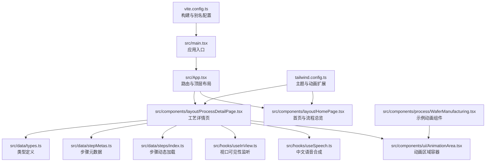
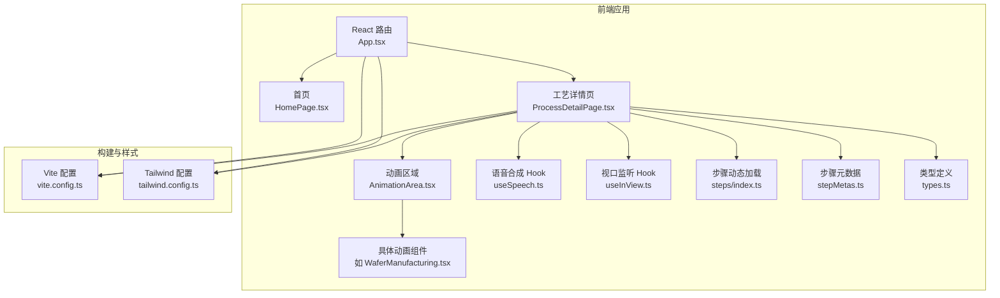
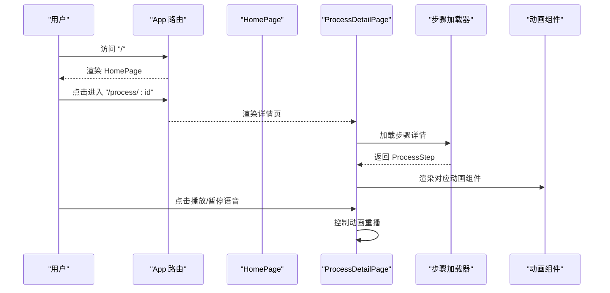
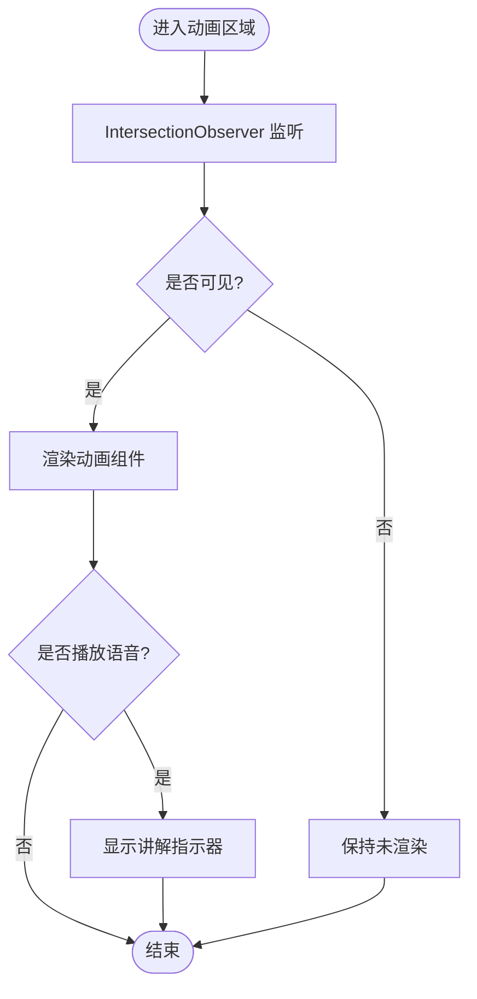
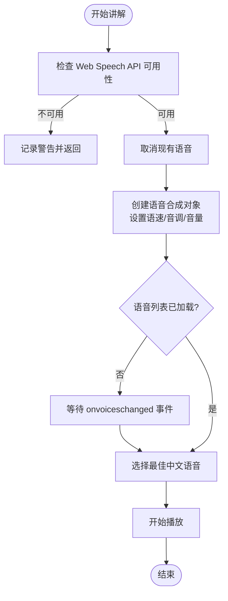
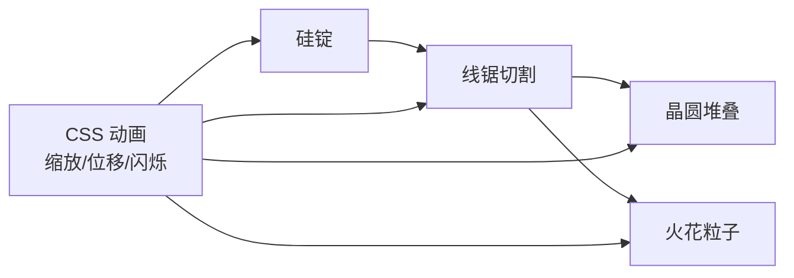
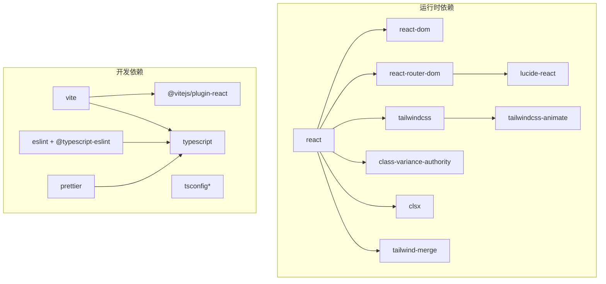

# 项目概述

<cite>
**本文引用的文件**
- [package.json](file://package.json)
- [vite.config.ts](file://vite.config.ts)
- [tailwind.config.ts](file://tailwind.config.ts)
- [src/main.tsx](file://src/main.tsx)
- [src/App.tsx](file://src/App.tsx)
- [src/components/layout/HomePage.tsx](file://src/components/layout/HomePage.tsx)
- [src/components/layout/ProcessDetailPage.tsx](file://src/components/layout/ProcessDetailPage.tsx)
- [src/components/ui/AnimationArea.tsx](file://src/components/ui/AnimationArea.tsx)
- [src/components/process/WaferManufacturing.tsx](file://src/components/process/WaferManufacturing.tsx)
- [src/data/stepMetas.ts](file://src/data/stepMetas.ts)
- [src/data/steps/index.ts](file://src/data/steps/index.ts)
- [src/data/types.ts](file://src/data/types.ts)
- [src/hooks/useSpeech.ts](file://src/hooks/useSpeech.ts)
- [src/hooks/useInView.ts](file://src/hooks/useInView.ts)
</cite>

## 目录
1. [简介](#简介)
2. [项目结构](#项目结构)
3. [核心组件](#核心组件)
4. [架构总览](#架构总览)
5. [详细组件分析](#详细组件分析)
6. [依赖分析](#依赖分析)
7. [性能考虑](#性能考虑)
8. [故障排查指南](#故障排查指南)
9. [结论](#结论)
10. [附录](#附录)

## 简介
本项目是一个面向教育场景的交互式芯片制造工艺演示应用，旨在通过动画与可视化的方式，完整呈现从沙子到芯片的半导体制造全流程。系统围绕十大核心工艺步骤，结合中文语音讲解、关键指标展示与企业角色映射，帮助不同背景的学习者以沉浸式体验理解芯片制造的复杂性与精密性。

- 教育价值：将抽象的工艺流程转化为直观的动画与讲解，降低理解门槛。
- 交互体验：支持语音播放/暂停、动画重播、进度导航与企业信息联动。
- 技术特色：基于前端技术栈构建，强调可访问性与跨平台兼容。

## 项目结构
项目采用基于功能域的组织方式，主要目录与职责如下：
- src/components：按布局与业务功能拆分的组件集合（layout、process、ui）
- src/data：数据模型、步骤元数据与动态加载逻辑
- src/hooks：通用自定义 Hook（语音合成、视口可见性监听）
- src/lib/utils.ts：工具函数（当前文件存在但未在上下文中使用）
- 根配置：Vite、TailwindCSS、TypeScript、ESLint/Prettier

图表来源
- [src/main.tsx:1-11](file://src/main.tsx#L1-L11)
- [src/App.tsx:1-23](file://src/App.tsx#L1-L23)
- [src/components/layout/HomePage.tsx:1-85](file://src/components/layout/HomePage.tsx#L1-L85)
- [src/components/layout/ProcessDetailPage.tsx:1-397](file://src/components/layout/ProcessDetailPage.tsx#L1-L397)
- [src/components/ui/AnimationArea.tsx:1-29](file://src/components/ui/AnimationArea.tsx#L1-L29)
- [src/components/process/WaferManufacturing.tsx:1-122](file://src/components/process/WaferManufacturing.tsx#L1-L122)
- [src/data/steps/index.ts:1-34](file://src/data/steps/index.ts#L1-L34)
- [src/data/stepMetas.ts:1-103](file://src/data/stepMetas.ts#L1-L103)
- [src/data/types.ts:1-33](file://src/data/types.ts#L1-L33)
- [src/hooks/useSpeech.ts:1-135](file://src/hooks/useSpeech.ts#L1-L135)
- [src/hooks/useInView.ts:1-32](file://src/hooks/useInView.ts#L1-L32)
- [vite.config.ts:1-13](file://vite.config.ts#L1-L13)
- [tailwind.config.ts:1-143](file://tailwind.config.ts#L1-L143)

章节来源
- [package.json:1-45](file://package.json#L1-L45)
- [vite.config.ts:1-13](file://vite.config.ts#L1-L13)
- [tailwind.config.ts:1-143](file://tailwind.config.ts#L1-L143)

## 核心组件
- 应用入口与路由
  - 入口文件负责挂载 React 应用与全局样式。
  - 路由层定义首页、工艺详情页与 404 页面，使用 React Router 进行页面切换。
- 首页与流程总览
  - 首页提供引导性文案、统计信息与流程图谱入口，帮助用户快速了解项目价值与结构。
- 工艺详情页
  - 动态加载指定工艺步骤的数据与动画组件，提供语音讲解、进度条、步骤导航与企业信息展示。
- 动画区域
  - 基于视口可见性监听决定是否渲染动画组件，减少不必要的计算开销。
- 语音合成 Hook
  - 自动选择适合中文的自然语音，支持偏好记忆与手动切换，优化讲解体验。
- 数据层
  - 类型定义统一描述公司、步骤与子步骤；步骤元数据提供顺序与外观信息；动态加载器按需加载具体步骤模块。

章节来源
- [src/main.tsx:1-11](file://src/main.tsx#L1-L11)
- [src/App.tsx:1-23](file://src/App.tsx#L1-L23)
- [src/components/layout/HomePage.tsx:1-85](file://src/components/layout/HomePage.tsx#L1-L85)
- [src/components/layout/ProcessDetailPage.tsx:1-397](file://src/components/layout/ProcessDetailPage.tsx#L1-L397)
- [src/components/ui/AnimationArea.tsx:1-29](file://src/components/ui/AnimationArea.tsx#L1-L29)
- [src/hooks/useSpeech.ts:1-135](file://src/hooks/useSpeech.ts#L1-L135)
- [src/hooks/useInView.ts:1-32](file://src/hooks/useInView.ts#L1-L32)
- [src/data/types.ts:1-33](file://src/data/types.ts#L1-L33)
- [src/data/stepMetas.ts:1-103](file://src/data/stepMetas.ts#L1-L103)
- [src/data/steps/index.ts:1-34](file://src/data/steps/index.ts#L1-L34)

## 架构总览
系统采用“路由驱动 + 按需加载 + 组件化动画”的架构设计，强调模块解耦与可扩展性。

图表来源
- [src/App.tsx:1-23](file://src/App.tsx#L1-L23)
- [src/components/layout/HomePage.tsx:1-85](file://src/components/layout/HomePage.tsx#L1-L85)
- [src/components/layout/ProcessDetailPage.tsx:1-397](file://src/components/layout/ProcessDetailPage.tsx#L1-L397)
- [src/components/ui/AnimationArea.tsx:1-29](file://src/components/ui/AnimationArea.tsx#L1-L29)
- [src/components/process/WaferManufacturing.tsx:1-122](file://src/components/process/WaferManufacturing.tsx#L1-L122)
- [src/data/steps/index.ts:1-34](file://src/data/steps/index.ts#L1-L34)
- [src/data/stepMetas.ts:1-103](file://src/data/stepMetas.ts#L1-L103)
- [src/data/types.ts:1-33](file://src/data/types.ts#L1-L33)
- [src/hooks/useSpeech.ts:1-135](file://src/hooks/useSpeech.ts#L1-L135)
- [src/hooks/useInView.ts:1-32](file://src/hooks/useInView.ts#L1-L32)
- [vite.config.ts:1-13](file://vite.config.ts#L1-L13)
- [tailwind.config.ts:1-143](file://tailwind.config.ts#L1-L143)

## 详细组件分析

### 路由与页面流
- 首页：提供项目介绍、统计数据与流程入口，引导用户进入首个工艺步骤。
- 工艺详情页：根据 URL 参数动态加载步骤详情，渲染对应动画与信息面板，支持语音讲解与重播。
- 404 页面：兜底处理未知路径。

图表来源
- [src/App.tsx:1-23](file://src/App.tsx#L1-L23)
- [src/components/layout/HomePage.tsx:1-85](file://src/components/layout/HomePage.tsx#L1-L85)
- [src/components/layout/ProcessDetailPage.tsx:1-397](file://src/components/layout/ProcessDetailPage.tsx#L1-L397)
- [src/data/steps/index.ts:1-34](file://src/data/steps/index.ts#L1-L34)

章节来源
- [src/App.tsx:1-23](file://src/App.tsx#L1-L23)
- [src/components/layout/HomePage.tsx:1-85](file://src/components/layout/HomePage.tsx#L1-L85)
- [src/components/layout/ProcessDetailPage.tsx:1-397](file://src/components/layout/ProcessDetailPage.tsx#L1-L397)

### 动画区域与视口可见性
- 使用 IntersectionObserver 判定动画区域是否进入视口，仅在可见时渲染动画组件，提升性能与体验。
- 支持在语音播放时显示“正在讲解”指示器。

图表来源
- [src/components/ui/AnimationArea.tsx:1-29](file://src/components/ui/AnimationArea.tsx#L1-L29)
- [src/hooks/useInView.ts:1-32](file://src/hooks/useInView.ts#L1-L32)

章节来源
- [src/components/ui/AnimationArea.tsx:1-29](file://src/components/ui/AnimationArea.tsx#L1-L29)
- [src/hooks/useInView.ts:1-32](file://src/hooks/useInView.ts#L1-L32)

### 语音讲解与偏好管理
- 自动评分并选择最适合中文的语音，优先考虑神经元/自然音质、本地服务与 zh-CN 语言。
- 支持用户手动切换语音并持久化偏好，避免重复选择。
- 提供播放/停止接口，确保在页面切换或重播时正确清理状态。

图表来源
- [src/hooks/useSpeech.ts:1-135](file://src/hooks/useSpeech.ts#L1-L135)

章节来源
- [src/hooks/useSpeech.ts:1-135](file://src/hooks/useSpeech.ts#L1-L135)

### 示例动画：晶圆制造
- 通过 SVG 与 CSS 动画模拟 CZ 法拉硅锭、线锯切割、晶圆堆叠与火花粒子效果，配合延迟与循环动画，还原真实制造过程的关键片段。

图表来源
- [src/components/process/WaferManufacturing.tsx:1-122](file://src/components/process/WaferManufacturing.tsx#L1-L122)

章节来源
- [src/components/process/WaferManufacturing.tsx:1-122](file://src/components/process/WaferManufacturing.tsx#L1-L122)

## 依赖分析
- 运行时依赖
  - React 生态：React、React DOM、React Router DOM
  - UI 与样式：Lucide React（图标）、Tailwind CSS（原子类）、Tailwind 动画插件
  - 实用工具：class-variance-authority、clsx、tailwind-merge
- 开发依赖
  - 构建：Vite、@vitejs/plugin-react
  - 样式：TailwindCSS、PostCSS、autoprefixer
  - TypeScript：typescript、@types/react、@types/react-dom
  - 质量：ESLint、@typescript-eslint、Prettier

图表来源
- [package.json:15-43](file://package.json#L15-L43)

章节来源
- [package.json:1-45](file://package.json#L1-L45)

## 性能考虑
- 懒加载与按需渲染
  - 工艺详情页通过动态导入加载步骤模块，避免一次性加载全部资源。
  - 动画组件仅在视口可见时渲染，降低初始渲染压力。
- 语音与动画解耦
  - 语音播放独立于动画渲染，避免相互阻塞。
- 样式与动画
  - Tailwind 扩展提供丰富的动画类，建议在移动端谨慎启用高开销动画，必要时通过媒体查询降级。

章节来源
- [src/data/steps/index.ts:1-34](file://src/data/steps/index.ts#L1-L34)
- [src/components/ui/AnimationArea.tsx:1-29](file://src/components/ui/AnimationArea.tsx#L1-L29)
- [src/hooks/useInView.ts:1-32](file://src/hooks/useInView.ts#L1-L32)
- [tailwind.config.ts:67-136](file://tailwind.config.ts#L67-L136)

## 故障排查指南
- 语音无法播放
  - 确认浏览器支持 Web Speech API；若语音列表为空，等待 onvoiceschanged 事件后重试。
  - 检查是否被浏览器静默策略阻止；尝试在用户手势后触发播放。
- 动画不显示
  - 确认动画区域已进入视口；检查 IntersectionObserver 是否正常工作。
  - 确认对应动画组件已正确注册到动画映射表。
- 路由跳转异常
  - 检查步骤 ID 是否存在于步骤元数据；确认动态加载器是否存在对应模块。
- 样式异常
  - 确认 Tailwind 配置已正确扫描源文件；检查颜色变量与动画类名拼写。

章节来源
- [src/hooks/useSpeech.ts:74-107](file://src/hooks/useSpeech.ts#L74-L107)
- [src/components/ui/AnimationArea.tsx:11-28](file://src/components/ui/AnimationArea.tsx#L11-L28)
- [src/data/steps/index.ts:16-21](file://src/data/steps/index.ts#L16-L21)
- [src/data/stepMetas.ts:11-102](file://src/data/stepMetas.ts#L11-L102)
- [tailwind.config.ts:5-8](file://tailwind.config.ts#L5-L8)

## 结论
本项目以“教育 + 交互 + 可视化”为核心目标，通过清晰的组件边界、按需加载与动画优化，构建了一个易于扩展且具有良好用户体验的芯片制造演示应用。对于初学者，它提供了循序渐进的学习路径与多模态讲解；对于开发者，它展示了前端工程化的最佳实践与可复用的 Hook 设计。

## 附录
- 项目背景与应用场景
  - 背景：半导体产业对人才教育与公众科普具有重要意义，需要直观、易懂的演示工具。
  - 场景：课堂演示、在线课程、企业培训、科技馆互动展项。
- 目标用户群体
  - 初学者：学生、教师、对半导体感兴趣的公众。
  - 从业者：工程师、研发人员、供应链相关人员。
- 技术选型理由
  - React：组件化与生态完善，便于维护与扩展。
  - Vite：快速冷启动与热更新，提升开发效率。
  - Tailwind：原子类与主题系统，快速搭建一致的视觉风格。
  - Web Speech API：原生中文语音合成，无需额外服务端依赖。
- 架构设计理念
  - 分层清晰：路由层、页面层、组件层、数据层职责明确。
  - 解耦与可扩展：动态加载、Hook 复用、类型约束。
  - 用户体验优先：懒加载、视口感知、语音偏好持久化。